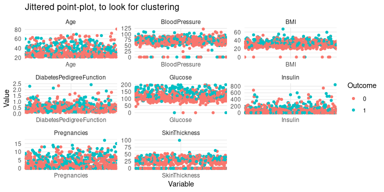
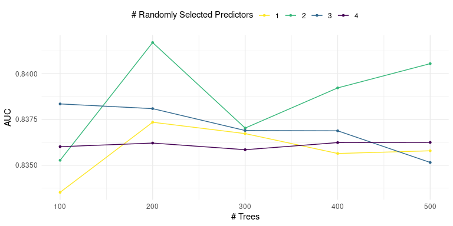

# Predicting Diabetes in patients
The following document is a final project fro Biological Databases & Data mining, in which we will attempt to build and evaluate multiple models to predict diabetes in patients. The caveat is that we expect our training data to contain a lot of missing data.


# Data Loading 
Let's Load the data and have a quick glance at it!

<div class="layout-chunk" data-layout="l-page">
<details>
<summary>Show code</summary>
<div class="sourceCode"><pre class="sourceCode r"><code class="sourceCode r"><span><span class='va'>data</span> <span class='op'>&lt;-</span> <span class='fu'><a href='https://rdrr.io/r/utils/read.table.html'>read.csv</a></span><span class='op'>(</span><span class='st'>"PimaIndiansDiabetes.csv"</span><span class='op'>)</span></span>
<span><span class='fu'>rmarkdown</span><span class='fu'>::</span><span class='fu'><a href='https://pkgs.rstudio.com/rmarkdown/reference/paged_table.html'>paged_table</a></span><span class='op'>(</span><span class='va'>data</span><span class='op'>)</span></span></code></pre></div>

</details><div data-pagedtable="false">
  <script data-pagedtable-source type="application/json">
{"columns":[{"label":["Pregnancies"],"name":[1],"type":["int"],"align":["right"]},{"label":["Glucose"],"name":[2],"type":["int"],"align":["right"]},{"label":["BloodPressure"],"name":[3],"type":["int"],"align":["right"]},{"label":["SkinThickness"],"name":[4],"type":["int"],"align":["right"]},{"label":["Insulin"],"name":[5],"type":["int"],"align":["right"]},{"label":["BMI"],"name":[6],"type":["dbl"],"align":["right"]},{"label":["DiabetesPedigreeFunction"],"name":[7],"type":["dbl"],"align":["right"]},{"label":["Age"],"name":[8],"type":["int"],"align":["right"]},{"label":["Outcome"],"name":[9],"type":["int"],"align":["right"]}],"data":[{"1":"6","2":"148","3":"72","4":"35","5":"0","6":"33.6","7":"0.627","8":"50","9":"1"},{"1":"1","2":"85","3":"66","4":"29","5":"0","6":"26.6","7":"0.351","8":"31","9":"0"},{"1":"8","2":"183","3":"64","4":"0","5":"0","6":"23.3","7":"0.672","8":"32","9":"1"},{"1":"1","2":"89","3":"66","4":"23","5":"94","6":"28.1","7":"0.167","8":"21","9":"0"},{"1":"0","2":"137","3":"40","4":"35","5":"168","6":"43.1","7":"2.288","8":"33","9":"1"},{"1":"5","2":"116","3":"74","4":"0","5":"0","6":"25.6","7":"0.201","8":"30","9":"0"},{"1":"3","2":"78","3":"50","4":"32","5":"88","6":"31.0","7":"0.248","8":"26","9":"1"},{"1":"10","2":"115","3":"0","4":"0","5":"0","6":"35.3","7":"0.134","8":"29","9":"0"},{"1":"2","2":"197","3":"70","4":"45","5":"543","6":"30.5","7":"0.158","8":"53","9":"1"},{"1":"8","2":"125","3":"96","4":"0","5":"0","6":"0.0","7":"0.232","8":"54","9":"1"},{"1":"4","2":"110","3":"92","4":"0","5":"0","6":"37.6","7":"0.191","8":"30","9":"0"},{"1":"10","2":"168","3":"74","4":"0","5":"0","6":"38.0","7":"0.537","8":"34","9":"1"},{"1":"10","2":"139","3":"80","4":"0","5":"0","6":"27.1","7":"1.441","8":"57","9":"0"},{"1":"1","2":"189","3":"60","4":"23","5":"846","6":"30.1","7":"0.398","8":"59","9":"1"},{"1":"5","2":"166","3":"72","4":"19","5":"175","6":"25.8","7":"0.587","8":"51","9":"1"},{"1":"7","2":"100","3":"0","4":"0","5":"0","6":"30.0","7":"0.484","8":"32","9":"1"},{"1":"0","2":"118","3":"84","4":"47","5":"230","6":"45.8","7":"0.551","8":"31","9":"1"},{"1":"7","2":"107","3":"74","4":"0","5":"0","6":"29.6","7":"0.254","8":"31","9":"1"},{"1":"1","2":"103","3":"30","4":"38","5":"83","6":"43.3","7":"0.183","8":"33","9":"0"},{"1":"1","2":"115","3":"70","4":"30","5":"96","6":"34.6","7":"0.529","8":"32","9":"1"},{"1":"3","2":"126","3":"88","4":"41","5":"235","6":"39.3","7":"0.704","8":"27","9":"0"},{"1":"8","2":"99","3":"84","4":"0","5":"0","6":"35.4","7":"0.388","8":"50","9":"0"},{"1":"7","2":"196","3":"90","4":"0","5":"0","6":"39.8","7":"0.451","8":"41","9":"1"},{"1":"9","2":"119","3":"80","4":"35","5":"0","6":"29.0","7":"0.263","8":"29","9":"1"},{"1":"11","2":"143","3":"94","4":"33","5":"146","6":"36.6","7":"0.254","8":"51","9":"1"},{"1":"10","2":"125","3":"70","4":"26","5":"115","6":"31.1","7":"0.205","8":"41","9":"1"},{"1":"7","2":"147","3":"76","4":"0","5":"0","6":"39.4","7":"0.257","8":"43","9":"1"},{"1":"1","2":"97","3":"66","4":"15","5":"140","6":"23.2","7":"0.487","8":"22","9":"0"},{"1":"13","2":"145","3":"82","4":"19","5":"110","6":"22.2","7":"0.245","8":"57","9":"0"},{"1":"5","2":"117","3":"92","4":"0","5":"0","6":"34.1","7":"0.337","8":"38","9":"0"},{"1":"5","2":"109","3":"75","4":"26","5":"0","6":"36.0","7":"0.546","8":"60","9":"0"},{"1":"3","2":"158","3":"76","4":"36","5":"245","6":"31.6","7":"0.851","8":"28","9":"1"},{"1":"3","2":"88","3":"58","4":"11","5":"54","6":"24.8","7":"0.267","8":"22","9":"0"},{"1":"6","2":"92","3":"92","4":"0","5":"0","6":"19.9","7":"0.188","8":"28","9":"0"},{"1":"10","2":"122","3":"78","4":"31","5":"0","6":"27.6","7":"0.512","8":"45","9":"0"},{"1":"4","2":"103","3":"60","4":"33","5":"192","6":"24.0","7":"0.966","8":"33","9":"0"},{"1":"11","2":"138","3":"76","4":"0","5":"0","6":"33.2","7":"0.420","8":"35","9":"0"},{"1":"9","2":"102","3":"76","4":"37","5":"0","6":"32.9","7":"0.665","8":"46","9":"1"},{"1":"2","2":"90","3":"68","4":"42","5":"0","6":"38.2","7":"0.503","8":"27","9":"1"},{"1":"4","2":"111","3":"72","4":"47","5":"207","6":"37.1","7":"1.390","8":"56","9":"1"},{"1":"3","2":"180","3":"64","4":"25","5":"70","6":"34.0","7":"0.271","8":"26","9":"0"},{"1":"7","2":"133","3":"84","4":"0","5":"0","6":"40.2","7":"0.696","8":"37","9":"0"},{"1":"7","2":"106","3":"92","4":"18","5":"0","6":"22.7","7":"0.235","8":"48","9":"0"},{"1":"9","2":"171","3":"110","4":"24","5":"240","6":"45.4","7":"0.721","8":"54","9":"1"},{"1":"7","2":"159","3":"64","4":"0","5":"0","6":"27.4","7":"0.294","8":"40","9":"0"},{"1":"0","2":"180","3":"66","4":"39","5":"0","6":"42.0","7":"1.893","8":"25","9":"1"},{"1":"1","2":"146","3":"56","4":"0","5":"0","6":"29.7","7":"0.564","8":"29","9":"0"},{"1":"2","2":"71","3":"70","4":"27","5":"0","6":"28.0","7":"0.586","8":"22","9":"0"},{"1":"7","2":"103","3":"66","4":"32","5":"0","6":"39.1","7":"0.344","8":"31","9":"1"},{"1":"7","2":"105","3":"0","4":"0","5":"0","6":"0.0","7":"0.305","8":"24","9":"0"},{"1":"1","2":"103","3":"80","4":"11","5":"82","6":"19.4","7":"0.491","8":"22","9":"0"},{"1":"1","2":"101","3":"50","4":"15","5":"36","6":"24.2","7":"0.526","8":"26","9":"0"},{"1":"5","2":"88","3":"66","4":"21","5":"23","6":"24.4","7":"0.342","8":"30","9":"0"},{"1":"8","2":"176","3":"90","4":"34","5":"300","6":"33.7","7":"0.467","8":"58","9":"1"},{"1":"7","2":"150","3":"66","4":"42","5":"342","6":"34.7","7":"0.718","8":"42","9":"0"},{"1":"1","2":"73","3":"50","4":"10","5":"0","6":"23.0","7":"0.248","8":"21","9":"0"},{"1":"7","2":"187","3":"68","4":"39","5":"304","6":"37.7","7":"0.254","8":"41","9":"1"},{"1":"0","2":"100","3":"88","4":"60","5":"110","6":"46.8","7":"0.962","8":"31","9":"0"},{"1":"0","2":"146","3":"82","4":"0","5":"0","6":"40.5","7":"1.781","8":"44","9":"0"},{"1":"0","2":"105","3":"64","4":"41","5":"142","6":"41.5","7":"0.173","8":"22","9":"0"},{"1":"2","2":"84","3":"0","4":"0","5":"0","6":"0.0","7":"0.304","8":"21","9":"0"},{"1":"8","2":"133","3":"72","4":"0","5":"0","6":"32.9","7":"0.270","8":"39","9":"1"},{"1":"5","2":"44","3":"62","4":"0","5":"0","6":"25.0","7":"0.587","8":"36","9":"0"},{"1":"2","2":"141","3":"58","4":"34","5":"128","6":"25.4","7":"0.699","8":"24","9":"0"},{"1":"7","2":"114","3":"66","4":"0","5":"0","6":"32.8","7":"0.258","8":"42","9":"1"},{"1":"5","2":"99","3":"74","4":"27","5":"0","6":"29.0","7":"0.203","8":"32","9":"0"},{"1":"0","2":"109","3":"88","4":"30","5":"0","6":"32.5","7":"0.855","8":"38","9":"1"},{"1":"2","2":"109","3":"92","4":"0","5":"0","6":"42.7","7":"0.845","8":"54","9":"0"},{"1":"1","2":"95","3":"66","4":"13","5":"38","6":"19.6","7":"0.334","8":"25","9":"0"},{"1":"4","2":"146","3":"85","4":"27","5":"100","6":"28.9","7":"0.189","8":"27","9":"0"},{"1":"2","2":"100","3":"66","4":"20","5":"90","6":"32.9","7":"0.867","8":"28","9":"1"},{"1":"5","2":"139","3":"64","4":"35","5":"140","6":"28.6","7":"0.411","8":"26","9":"0"},{"1":"13","2":"126","3":"90","4":"0","5":"0","6":"43.4","7":"0.583","8":"42","9":"1"},{"1":"4","2":"129","3":"86","4":"20","5":"270","6":"35.1","7":"0.231","8":"23","9":"0"},{"1":"1","2":"79","3":"75","4":"30","5":"0","6":"32.0","7":"0.396","8":"22","9":"0"},{"1":"1","2":"0","3":"48","4":"20","5":"0","6":"24.7","7":"0.140","8":"22","9":"0"},{"1":"7","2":"62","3":"78","4":"0","5":"0","6":"32.6","7":"0.391","8":"41","9":"0"},{"1":"5","2":"95","3":"72","4":"33","5":"0","6":"37.7","7":"0.370","8":"27","9":"0"},{"1":"0","2":"131","3":"0","4":"0","5":"0","6":"43.2","7":"0.270","8":"26","9":"1"},{"1":"2","2":"112","3":"66","4":"22","5":"0","6":"25.0","7":"0.307","8":"24","9":"0"},{"1":"3","2":"113","3":"44","4":"13","5":"0","6":"22.4","7":"0.140","8":"22","9":"0"},{"1":"2","2":"74","3":"0","4":"0","5":"0","6":"0.0","7":"0.102","8":"22","9":"0"},{"1":"7","2":"83","3":"78","4":"26","5":"71","6":"29.3","7":"0.767","8":"36","9":"0"},{"1":"0","2":"101","3":"65","4":"28","5":"0","6":"24.6","7":"0.237","8":"22","9":"0"},{"1":"5","2":"137","3":"108","4":"0","5":"0","6":"48.8","7":"0.227","8":"37","9":"1"},{"1":"2","2":"110","3":"74","4":"29","5":"125","6":"32.4","7":"0.698","8":"27","9":"0"},{"1":"13","2":"106","3":"72","4":"54","5":"0","6":"36.6","7":"0.178","8":"45","9":"0"},{"1":"2","2":"100","3":"68","4":"25","5":"71","6":"38.5","7":"0.324","8":"26","9":"0"},{"1":"15","2":"136","3":"70","4":"32","5":"110","6":"37.1","7":"0.153","8":"43","9":"1"},{"1":"1","2":"107","3":"68","4":"19","5":"0","6":"26.5","7":"0.165","8":"24","9":"0"},{"1":"1","2":"80","3":"55","4":"0","5":"0","6":"19.1","7":"0.258","8":"21","9":"0"},{"1":"4","2":"123","3":"80","4":"15","5":"176","6":"32.0","7":"0.443","8":"34","9":"0"},{"1":"7","2":"81","3":"78","4":"40","5":"48","6":"46.7","7":"0.261","8":"42","9":"0"},{"1":"4","2":"134","3":"72","4":"0","5":"0","6":"23.8","7":"0.277","8":"60","9":"1"},{"1":"2","2":"142","3":"82","4":"18","5":"64","6":"24.7","7":"0.761","8":"21","9":"0"},{"1":"6","2":"144","3":"72","4":"27","5":"228","6":"33.9","7":"0.255","8":"40","9":"0"},{"1":"2","2":"92","3":"62","4":"28","5":"0","6":"31.6","7":"0.130","8":"24","9":"0"},{"1":"1","2":"71","3":"48","4":"18","5":"76","6":"20.4","7":"0.323","8":"22","9":"0"},{"1":"6","2":"93","3":"50","4":"30","5":"64","6":"28.7","7":"0.356","8":"23","9":"0"},{"1":"1","2":"122","3":"90","4":"51","5":"220","6":"49.7","7":"0.325","8":"31","9":"1"},{"1":"1","2":"163","3":"72","4":"0","5":"0","6":"39.0","7":"1.222","8":"33","9":"1"},{"1":"1","2":"151","3":"60","4":"0","5":"0","6":"26.1","7":"0.179","8":"22","9":"0"},{"1":"0","2":"125","3":"96","4":"0","5":"0","6":"22.5","7":"0.262","8":"21","9":"0"},{"1":"1","2":"81","3":"72","4":"18","5":"40","6":"26.6","7":"0.283","8":"24","9":"0"},{"1":"2","2":"85","3":"65","4":"0","5":"0","6":"39.6","7":"0.930","8":"27","9":"0"},{"1":"1","2":"126","3":"56","4":"29","5":"152","6":"28.7","7":"0.801","8":"21","9":"0"},{"1":"1","2":"96","3":"122","4":"0","5":"0","6":"22.4","7":"0.207","8":"27","9":"0"},{"1":"4","2":"144","3":"58","4":"28","5":"140","6":"29.5","7":"0.287","8":"37","9":"0"},{"1":"3","2":"83","3":"58","4":"31","5":"18","6":"34.3","7":"0.336","8":"25","9":"0"},{"1":"0","2":"95","3":"85","4":"25","5":"36","6":"37.4","7":"0.247","8":"24","9":"1"},{"1":"3","2":"171","3":"72","4":"33","5":"135","6":"33.3","7":"0.199","8":"24","9":"1"},{"1":"8","2":"155","3":"62","4":"26","5":"495","6":"34.0","7":"0.543","8":"46","9":"1"},{"1":"1","2":"89","3":"76","4":"34","5":"37","6":"31.2","7":"0.192","8":"23","9":"0"},{"1":"4","2":"76","3":"62","4":"0","5":"0","6":"34.0","7":"0.391","8":"25","9":"0"},{"1":"7","2":"160","3":"54","4":"32","5":"175","6":"30.5","7":"0.588","8":"39","9":"1"},{"1":"4","2":"146","3":"92","4":"0","5":"0","6":"31.2","7":"0.539","8":"61","9":"1"},{"1":"5","2":"124","3":"74","4":"0","5":"0","6":"34.0","7":"0.220","8":"38","9":"1"},{"1":"5","2":"78","3":"48","4":"0","5":"0","6":"33.7","7":"0.654","8":"25","9":"0"},{"1":"4","2":"97","3":"60","4":"23","5":"0","6":"28.2","7":"0.443","8":"22","9":"0"},{"1":"4","2":"99","3":"76","4":"15","5":"51","6":"23.2","7":"0.223","8":"21","9":"0"},{"1":"0","2":"162","3":"76","4":"56","5":"100","6":"53.2","7":"0.759","8":"25","9":"1"},{"1":"6","2":"111","3":"64","4":"39","5":"0","6":"34.2","7":"0.260","8":"24","9":"0"},{"1":"2","2":"107","3":"74","4":"30","5":"100","6":"33.6","7":"0.404","8":"23","9":"0"},{"1":"5","2":"132","3":"80","4":"0","5":"0","6":"26.8","7":"0.186","8":"69","9":"0"},{"1":"0","2":"113","3":"76","4":"0","5":"0","6":"33.3","7":"0.278","8":"23","9":"1"},{"1":"1","2":"88","3":"30","4":"42","5":"99","6":"55.0","7":"0.496","8":"26","9":"1"},{"1":"3","2":"120","3":"70","4":"30","5":"135","6":"42.9","7":"0.452","8":"30","9":"0"},{"1":"1","2":"118","3":"58","4":"36","5":"94","6":"33.3","7":"0.261","8":"23","9":"0"},{"1":"1","2":"117","3":"88","4":"24","5":"145","6":"34.5","7":"0.403","8":"40","9":"1"},{"1":"0","2":"105","3":"84","4":"0","5":"0","6":"27.9","7":"0.741","8":"62","9":"1"},{"1":"4","2":"173","3":"70","4":"14","5":"168","6":"29.7","7":"0.361","8":"33","9":"1"},{"1":"9","2":"122","3":"56","4":"0","5":"0","6":"33.3","7":"1.114","8":"33","9":"1"},{"1":"3","2":"170","3":"64","4":"37","5":"225","6":"34.5","7":"0.356","8":"30","9":"1"},{"1":"8","2":"84","3":"74","4":"31","5":"0","6":"38.3","7":"0.457","8":"39","9":"0"},{"1":"2","2":"96","3":"68","4":"13","5":"49","6":"21.1","7":"0.647","8":"26","9":"0"},{"1":"2","2":"125","3":"60","4":"20","5":"140","6":"33.8","7":"0.088","8":"31","9":"0"},{"1":"0","2":"100","3":"70","4":"26","5":"50","6":"30.8","7":"0.597","8":"21","9":"0"},{"1":"0","2":"93","3":"60","4":"25","5":"92","6":"28.7","7":"0.532","8":"22","9":"0"},{"1":"0","2":"129","3":"80","4":"0","5":"0","6":"31.2","7":"0.703","8":"29","9":"0"},{"1":"5","2":"105","3":"72","4":"29","5":"325","6":"36.9","7":"0.159","8":"28","9":"0"},{"1":"3","2":"128","3":"78","4":"0","5":"0","6":"21.1","7":"0.268","8":"55","9":"0"},{"1":"5","2":"106","3":"82","4":"30","5":"0","6":"39.5","7":"0.286","8":"38","9":"0"},{"1":"2","2":"108","3":"52","4":"26","5":"63","6":"32.5","7":"0.318","8":"22","9":"0"},{"1":"10","2":"108","3":"66","4":"0","5":"0","6":"32.4","7":"0.272","8":"42","9":"1"},{"1":"4","2":"154","3":"62","4":"31","5":"284","6":"32.8","7":"0.237","8":"23","9":"0"},{"1":"0","2":"102","3":"75","4":"23","5":"0","6":"0.0","7":"0.572","8":"21","9":"0"},{"1":"9","2":"57","3":"80","4":"37","5":"0","6":"32.8","7":"0.096","8":"41","9":"0"},{"1":"2","2":"106","3":"64","4":"35","5":"119","6":"30.5","7":"1.400","8":"34","9":"0"},{"1":"5","2":"147","3":"78","4":"0","5":"0","6":"33.7","7":"0.218","8":"65","9":"0"},{"1":"2","2":"90","3":"70","4":"17","5":"0","6":"27.3","7":"0.085","8":"22","9":"0"},{"1":"1","2":"136","3":"74","4":"50","5":"204","6":"37.4","7":"0.399","8":"24","9":"0"},{"1":"4","2":"114","3":"65","4":"0","5":"0","6":"21.9","7":"0.432","8":"37","9":"0"},{"1":"9","2":"156","3":"86","4":"28","5":"155","6":"34.3","7":"1.189","8":"42","9":"1"},{"1":"1","2":"153","3":"82","4":"42","5":"485","6":"40.6","7":"0.687","8":"23","9":"0"},{"1":"8","2":"188","3":"78","4":"0","5":"0","6":"47.9","7":"0.137","8":"43","9":"1"},{"1":"7","2":"152","3":"88","4":"44","5":"0","6":"50.0","7":"0.337","8":"36","9":"1"},{"1":"2","2":"99","3":"52","4":"15","5":"94","6":"24.6","7":"0.637","8":"21","9":"0"},{"1":"1","2":"109","3":"56","4":"21","5":"135","6":"25.2","7":"0.833","8":"23","9":"0"},{"1":"2","2":"88","3":"74","4":"19","5":"53","6":"29.0","7":"0.229","8":"22","9":"0"},{"1":"17","2":"163","3":"72","4":"41","5":"114","6":"40.9","7":"0.817","8":"47","9":"1"},{"1":"4","2":"151","3":"90","4":"38","5":"0","6":"29.7","7":"0.294","8":"36","9":"0"},{"1":"7","2":"102","3":"74","4":"40","5":"105","6":"37.2","7":"0.204","8":"45","9":"0"},{"1":"0","2":"114","3":"80","4":"34","5":"285","6":"44.2","7":"0.167","8":"27","9":"0"},{"1":"2","2":"100","3":"64","4":"23","5":"0","6":"29.7","7":"0.368","8":"21","9":"0"},{"1":"0","2":"131","3":"88","4":"0","5":"0","6":"31.6","7":"0.743","8":"32","9":"1"},{"1":"6","2":"104","3":"74","4":"18","5":"156","6":"29.9","7":"0.722","8":"41","9":"1"},{"1":"3","2":"148","3":"66","4":"25","5":"0","6":"32.5","7":"0.256","8":"22","9":"0"},{"1":"4","2":"120","3":"68","4":"0","5":"0","6":"29.6","7":"0.709","8":"34","9":"0"},{"1":"4","2":"110","3":"66","4":"0","5":"0","6":"31.9","7":"0.471","8":"29","9":"0"},{"1":"3","2":"111","3":"90","4":"12","5":"78","6":"28.4","7":"0.495","8":"29","9":"0"},{"1":"6","2":"102","3":"82","4":"0","5":"0","6":"30.8","7":"0.180","8":"36","9":"1"},{"1":"6","2":"134","3":"70","4":"23","5":"130","6":"35.4","7":"0.542","8":"29","9":"1"},{"1":"2","2":"87","3":"0","4":"23","5":"0","6":"28.9","7":"0.773","8":"25","9":"0"},{"1":"1","2":"79","3":"60","4":"42","5":"48","6":"43.5","7":"0.678","8":"23","9":"0"},{"1":"2","2":"75","3":"64","4":"24","5":"55","6":"29.7","7":"0.370","8":"33","9":"0"},{"1":"8","2":"179","3":"72","4":"42","5":"130","6":"32.7","7":"0.719","8":"36","9":"1"},{"1":"6","2":"85","3":"78","4":"0","5":"0","6":"31.2","7":"0.382","8":"42","9":"0"},{"1":"0","2":"129","3":"110","4":"46","5":"130","6":"67.1","7":"0.319","8":"26","9":"1"},{"1":"5","2":"143","3":"78","4":"0","5":"0","6":"45.0","7":"0.190","8":"47","9":"0"},{"1":"5","2":"130","3":"82","4":"0","5":"0","6":"39.1","7":"0.956","8":"37","9":"1"},{"1":"6","2":"87","3":"80","4":"0","5":"0","6":"23.2","7":"0.084","8":"32","9":"0"},{"1":"0","2":"119","3":"64","4":"18","5":"92","6":"34.9","7":"0.725","8":"23","9":"0"},{"1":"1","2":"0","3":"74","4":"20","5":"23","6":"27.7","7":"0.299","8":"21","9":"0"},{"1":"5","2":"73","3":"60","4":"0","5":"0","6":"26.8","7":"0.268","8":"27","9":"0"},{"1":"4","2":"141","3":"74","4":"0","5":"0","6":"27.6","7":"0.244","8":"40","9":"0"},{"1":"7","2":"194","3":"68","4":"28","5":"0","6":"35.9","7":"0.745","8":"41","9":"1"},{"1":"8","2":"181","3":"68","4":"36","5":"495","6":"30.1","7":"0.615","8":"60","9":"1"},{"1":"1","2":"128","3":"98","4":"41","5":"58","6":"32.0","7":"1.321","8":"33","9":"1"},{"1":"8","2":"109","3":"76","4":"39","5":"114","6":"27.9","7":"0.640","8":"31","9":"1"},{"1":"5","2":"139","3":"80","4":"35","5":"160","6":"31.6","7":"0.361","8":"25","9":"1"},{"1":"3","2":"111","3":"62","4":"0","5":"0","6":"22.6","7":"0.142","8":"21","9":"0"},{"1":"9","2":"123","3":"70","4":"44","5":"94","6":"33.1","7":"0.374","8":"40","9":"0"},{"1":"7","2":"159","3":"66","4":"0","5":"0","6":"30.4","7":"0.383","8":"36","9":"1"},{"1":"11","2":"135","3":"0","4":"0","5":"0","6":"52.3","7":"0.578","8":"40","9":"1"},{"1":"8","2":"85","3":"55","4":"20","5":"0","6":"24.4","7":"0.136","8":"42","9":"0"},{"1":"5","2":"158","3":"84","4":"41","5":"210","6":"39.4","7":"0.395","8":"29","9":"1"},{"1":"1","2":"105","3":"58","4":"0","5":"0","6":"24.3","7":"0.187","8":"21","9":"0"},{"1":"3","2":"107","3":"62","4":"13","5":"48","6":"22.9","7":"0.678","8":"23","9":"1"},{"1":"4","2":"109","3":"64","4":"44","5":"99","6":"34.8","7":"0.905","8":"26","9":"1"},{"1":"4","2":"148","3":"60","4":"27","5":"318","6":"30.9","7":"0.150","8":"29","9":"1"},{"1":"0","2":"113","3":"80","4":"16","5":"0","6":"31.0","7":"0.874","8":"21","9":"0"},{"1":"1","2":"138","3":"82","4":"0","5":"0","6":"40.1","7":"0.236","8":"28","9":"0"},{"1":"0","2":"108","3":"68","4":"20","5":"0","6":"27.3","7":"0.787","8":"32","9":"0"},{"1":"2","2":"99","3":"70","4":"16","5":"44","6":"20.4","7":"0.235","8":"27","9":"0"},{"1":"6","2":"103","3":"72","4":"32","5":"190","6":"37.7","7":"0.324","8":"55","9":"0"},{"1":"5","2":"111","3":"72","4":"28","5":"0","6":"23.9","7":"0.407","8":"27","9":"0"},{"1":"8","2":"196","3":"76","4":"29","5":"280","6":"37.5","7":"0.605","8":"57","9":"1"},{"1":"5","2":"162","3":"104","4":"0","5":"0","6":"37.7","7":"0.151","8":"52","9":"1"},{"1":"1","2":"96","3":"64","4":"27","5":"87","6":"33.2","7":"0.289","8":"21","9":"0"},{"1":"7","2":"184","3":"84","4":"33","5":"0","6":"35.5","7":"0.355","8":"41","9":"1"},{"1":"2","2":"81","3":"60","4":"22","5":"0","6":"27.7","7":"0.290","8":"25","9":"0"},{"1":"0","2":"147","3":"85","4":"54","5":"0","6":"42.8","7":"0.375","8":"24","9":"0"},{"1":"7","2":"179","3":"95","4":"31","5":"0","6":"34.2","7":"0.164","8":"60","9":"0"},{"1":"0","2":"140","3":"65","4":"26","5":"130","6":"42.6","7":"0.431","8":"24","9":"1"},{"1":"9","2":"112","3":"82","4":"32","5":"175","6":"34.2","7":"0.260","8":"36","9":"1"},{"1":"12","2":"151","3":"70","4":"40","5":"271","6":"41.8","7":"0.742","8":"38","9":"1"},{"1":"5","2":"109","3":"62","4":"41","5":"129","6":"35.8","7":"0.514","8":"25","9":"1"},{"1":"6","2":"125","3":"68","4":"30","5":"120","6":"30.0","7":"0.464","8":"32","9":"0"},{"1":"5","2":"85","3":"74","4":"22","5":"0","6":"29.0","7":"1.224","8":"32","9":"1"},{"1":"5","2":"112","3":"66","4":"0","5":"0","6":"37.8","7":"0.261","8":"41","9":"1"},{"1":"0","2":"177","3":"60","4":"29","5":"478","6":"34.6","7":"1.072","8":"21","9":"1"},{"1":"2","2":"158","3":"90","4":"0","5":"0","6":"31.6","7":"0.805","8":"66","9":"1"},{"1":"7","2":"119","3":"0","4":"0","5":"0","6":"25.2","7":"0.209","8":"37","9":"0"},{"1":"7","2":"142","3":"60","4":"33","5":"190","6":"28.8","7":"0.687","8":"61","9":"0"},{"1":"1","2":"100","3":"66","4":"15","5":"56","6":"23.6","7":"0.666","8":"26","9":"0"},{"1":"1","2":"87","3":"78","4":"27","5":"32","6":"34.6","7":"0.101","8":"22","9":"0"},{"1":"0","2":"101","3":"76","4":"0","5":"0","6":"35.7","7":"0.198","8":"26","9":"0"},{"1":"3","2":"162","3":"52","4":"38","5":"0","6":"37.2","7":"0.652","8":"24","9":"1"},{"1":"4","2":"197","3":"70","4":"39","5":"744","6":"36.7","7":"2.329","8":"31","9":"0"},{"1":"0","2":"117","3":"80","4":"31","5":"53","6":"45.2","7":"0.089","8":"24","9":"0"},{"1":"4","2":"142","3":"86","4":"0","5":"0","6":"44.0","7":"0.645","8":"22","9":"1"},{"1":"6","2":"134","3":"80","4":"37","5":"370","6":"46.2","7":"0.238","8":"46","9":"1"},{"1":"1","2":"79","3":"80","4":"25","5":"37","6":"25.4","7":"0.583","8":"22","9":"0"},{"1":"4","2":"122","3":"68","4":"0","5":"0","6":"35.0","7":"0.394","8":"29","9":"0"},{"1":"3","2":"74","3":"68","4":"28","5":"45","6":"29.7","7":"0.293","8":"23","9":"0"},{"1":"4","2":"171","3":"72","4":"0","5":"0","6":"43.6","7":"0.479","8":"26","9":"1"},{"1":"7","2":"181","3":"84","4":"21","5":"192","6":"35.9","7":"0.586","8":"51","9":"1"},{"1":"0","2":"179","3":"90","4":"27","5":"0","6":"44.1","7":"0.686","8":"23","9":"1"},{"1":"9","2":"164","3":"84","4":"21","5":"0","6":"30.8","7":"0.831","8":"32","9":"1"},{"1":"0","2":"104","3":"76","4":"0","5":"0","6":"18.4","7":"0.582","8":"27","9":"0"},{"1":"1","2":"91","3":"64","4":"24","5":"0","6":"29.2","7":"0.192","8":"21","9":"0"},{"1":"4","2":"91","3":"70","4":"32","5":"88","6":"33.1","7":"0.446","8":"22","9":"0"},{"1":"3","2":"139","3":"54","4":"0","5":"0","6":"25.6","7":"0.402","8":"22","9":"1"},{"1":"6","2":"119","3":"50","4":"22","5":"176","6":"27.1","7":"1.318","8":"33","9":"1"},{"1":"2","2":"146","3":"76","4":"35","5":"194","6":"38.2","7":"0.329","8":"29","9":"0"},{"1":"9","2":"184","3":"85","4":"15","5":"0","6":"30.0","7":"1.213","8":"49","9":"1"},{"1":"10","2":"122","3":"68","4":"0","5":"0","6":"31.2","7":"0.258","8":"41","9":"0"},{"1":"0","2":"165","3":"90","4":"33","5":"680","6":"52.3","7":"0.427","8":"23","9":"0"},{"1":"9","2":"124","3":"70","4":"33","5":"402","6":"35.4","7":"0.282","8":"34","9":"0"},{"1":"1","2":"111","3":"86","4":"19","5":"0","6":"30.1","7":"0.143","8":"23","9":"0"},{"1":"9","2":"106","3":"52","4":"0","5":"0","6":"31.2","7":"0.380","8":"42","9":"0"},{"1":"2","2":"129","3":"84","4":"0","5":"0","6":"28.0","7":"0.284","8":"27","9":"0"},{"1":"2","2":"90","3":"80","4":"14","5":"55","6":"24.4","7":"0.249","8":"24","9":"0"},{"1":"0","2":"86","3":"68","4":"32","5":"0","6":"35.8","7":"0.238","8":"25","9":"0"},{"1":"12","2":"92","3":"62","4":"7","5":"258","6":"27.6","7":"0.926","8":"44","9":"1"},{"1":"1","2":"113","3":"64","4":"35","5":"0","6":"33.6","7":"0.543","8":"21","9":"1"},{"1":"3","2":"111","3":"56","4":"39","5":"0","6":"30.1","7":"0.557","8":"30","9":"0"},{"1":"2","2":"114","3":"68","4":"22","5":"0","6":"28.7","7":"0.092","8":"25","9":"0"},{"1":"1","2":"193","3":"50","4":"16","5":"375","6":"25.9","7":"0.655","8":"24","9":"0"},{"1":"11","2":"155","3":"76","4":"28","5":"150","6":"33.3","7":"1.353","8":"51","9":"1"},{"1":"3","2":"191","3":"68","4":"15","5":"130","6":"30.9","7":"0.299","8":"34","9":"0"},{"1":"3","2":"141","3":"0","4":"0","5":"0","6":"30.0","7":"0.761","8":"27","9":"1"},{"1":"4","2":"95","3":"70","4":"32","5":"0","6":"32.1","7":"0.612","8":"24","9":"0"},{"1":"3","2":"142","3":"80","4":"15","5":"0","6":"32.4","7":"0.200","8":"63","9":"0"},{"1":"4","2":"123","3":"62","4":"0","5":"0","6":"32.0","7":"0.226","8":"35","9":"1"},{"1":"5","2":"96","3":"74","4":"18","5":"67","6":"33.6","7":"0.997","8":"43","9":"0"},{"1":"0","2":"138","3":"0","4":"0","5":"0","6":"36.3","7":"0.933","8":"25","9":"1"},{"1":"2","2":"128","3":"64","4":"42","5":"0","6":"40.0","7":"1.101","8":"24","9":"0"},{"1":"0","2":"102","3":"52","4":"0","5":"0","6":"25.1","7":"0.078","8":"21","9":"0"},{"1":"2","2":"146","3":"0","4":"0","5":"0","6":"27.5","7":"0.240","8":"28","9":"1"},{"1":"10","2":"101","3":"86","4":"37","5":"0","6":"45.6","7":"1.136","8":"38","9":"1"},{"1":"2","2":"108","3":"62","4":"32","5":"56","6":"25.2","7":"0.128","8":"21","9":"0"},{"1":"3","2":"122","3":"78","4":"0","5":"0","6":"23.0","7":"0.254","8":"40","9":"0"},{"1":"1","2":"71","3":"78","4":"50","5":"45","6":"33.2","7":"0.422","8":"21","9":"0"},{"1":"13","2":"106","3":"70","4":"0","5":"0","6":"34.2","7":"0.251","8":"52","9":"0"},{"1":"2","2":"100","3":"70","4":"52","5":"57","6":"40.5","7":"0.677","8":"25","9":"0"},{"1":"7","2":"106","3":"60","4":"24","5":"0","6":"26.5","7":"0.296","8":"29","9":"1"},{"1":"0","2":"104","3":"64","4":"23","5":"116","6":"27.8","7":"0.454","8":"23","9":"0"},{"1":"5","2":"114","3":"74","4":"0","5":"0","6":"24.9","7":"0.744","8":"57","9":"0"},{"1":"2","2":"108","3":"62","4":"10","5":"278","6":"25.3","7":"0.881","8":"22","9":"0"},{"1":"0","2":"146","3":"70","4":"0","5":"0","6":"37.9","7":"0.334","8":"28","9":"1"},{"1":"10","2":"129","3":"76","4":"28","5":"122","6":"35.9","7":"0.280","8":"39","9":"0"},{"1":"7","2":"133","3":"88","4":"15","5":"155","6":"32.4","7":"0.262","8":"37","9":"0"},{"1":"7","2":"161","3":"86","4":"0","5":"0","6":"30.4","7":"0.165","8":"47","9":"1"},{"1":"2","2":"108","3":"80","4":"0","5":"0","6":"27.0","7":"0.259","8":"52","9":"1"},{"1":"7","2":"136","3":"74","4":"26","5":"135","6":"26.0","7":"0.647","8":"51","9":"0"},{"1":"5","2":"155","3":"84","4":"44","5":"545","6":"38.7","7":"0.619","8":"34","9":"0"},{"1":"1","2":"119","3":"86","4":"39","5":"220","6":"45.6","7":"0.808","8":"29","9":"1"},{"1":"4","2":"96","3":"56","4":"17","5":"49","6":"20.8","7":"0.340","8":"26","9":"0"},{"1":"5","2":"108","3":"72","4":"43","5":"75","6":"36.1","7":"0.263","8":"33","9":"0"},{"1":"0","2":"78","3":"88","4":"29","5":"40","6":"36.9","7":"0.434","8":"21","9":"0"},{"1":"0","2":"107","3":"62","4":"30","5":"74","6":"36.6","7":"0.757","8":"25","9":"1"},{"1":"2","2":"128","3":"78","4":"37","5":"182","6":"43.3","7":"1.224","8":"31","9":"1"},{"1":"1","2":"128","3":"48","4":"45","5":"194","6":"40.5","7":"0.613","8":"24","9":"1"},{"1":"0","2":"161","3":"50","4":"0","5":"0","6":"21.9","7":"0.254","8":"65","9":"0"},{"1":"6","2":"151","3":"62","4":"31","5":"120","6":"35.5","7":"0.692","8":"28","9":"0"},{"1":"2","2":"146","3":"70","4":"38","5":"360","6":"28.0","7":"0.337","8":"29","9":"1"},{"1":"0","2":"126","3":"84","4":"29","5":"215","6":"30.7","7":"0.520","8":"24","9":"0"},{"1":"14","2":"100","3":"78","4":"25","5":"184","6":"36.6","7":"0.412","8":"46","9":"1"},{"1":"8","2":"112","3":"72","4":"0","5":"0","6":"23.6","7":"0.840","8":"58","9":"0"},{"1":"0","2":"167","3":"0","4":"0","5":"0","6":"32.3","7":"0.839","8":"30","9":"1"},{"1":"2","2":"144","3":"58","4":"33","5":"135","6":"31.6","7":"0.422","8":"25","9":"1"},{"1":"5","2":"77","3":"82","4":"41","5":"42","6":"35.8","7":"0.156","8":"35","9":"0"},{"1":"5","2":"115","3":"98","4":"0","5":"0","6":"52.9","7":"0.209","8":"28","9":"1"},{"1":"3","2":"150","3":"76","4":"0","5":"0","6":"21.0","7":"0.207","8":"37","9":"0"},{"1":"2","2":"120","3":"76","4":"37","5":"105","6":"39.7","7":"0.215","8":"29","9":"0"},{"1":"10","2":"161","3":"68","4":"23","5":"132","6":"25.5","7":"0.326","8":"47","9":"1"},{"1":"0","2":"137","3":"68","4":"14","5":"148","6":"24.8","7":"0.143","8":"21","9":"0"},{"1":"0","2":"128","3":"68","4":"19","5":"180","6":"30.5","7":"1.391","8":"25","9":"1"},{"1":"2","2":"124","3":"68","4":"28","5":"205","6":"32.9","7":"0.875","8":"30","9":"1"},{"1":"6","2":"80","3":"66","4":"30","5":"0","6":"26.2","7":"0.313","8":"41","9":"0"},{"1":"0","2":"106","3":"70","4":"37","5":"148","6":"39.4","7":"0.605","8":"22","9":"0"},{"1":"2","2":"155","3":"74","4":"17","5":"96","6":"26.6","7":"0.433","8":"27","9":"1"},{"1":"3","2":"113","3":"50","4":"10","5":"85","6":"29.5","7":"0.626","8":"25","9":"0"},{"1":"7","2":"109","3":"80","4":"31","5":"0","6":"35.9","7":"1.127","8":"43","9":"1"},{"1":"2","2":"112","3":"68","4":"22","5":"94","6":"34.1","7":"0.315","8":"26","9":"0"},{"1":"3","2":"99","3":"80","4":"11","5":"64","6":"19.3","7":"0.284","8":"30","9":"0"},{"1":"3","2":"182","3":"74","4":"0","5":"0","6":"30.5","7":"0.345","8":"29","9":"1"},{"1":"3","2":"115","3":"66","4":"39","5":"140","6":"38.1","7":"0.150","8":"28","9":"0"},{"1":"6","2":"194","3":"78","4":"0","5":"0","6":"23.5","7":"0.129","8":"59","9":"1"},{"1":"4","2":"129","3":"60","4":"12","5":"231","6":"27.5","7":"0.527","8":"31","9":"0"},{"1":"3","2":"112","3":"74","4":"30","5":"0","6":"31.6","7":"0.197","8":"25","9":"1"},{"1":"0","2":"124","3":"70","4":"20","5":"0","6":"27.4","7":"0.254","8":"36","9":"1"},{"1":"13","2":"152","3":"90","4":"33","5":"29","6":"26.8","7":"0.731","8":"43","9":"1"},{"1":"2","2":"112","3":"75","4":"32","5":"0","6":"35.7","7":"0.148","8":"21","9":"0"},{"1":"1","2":"157","3":"72","4":"21","5":"168","6":"25.6","7":"0.123","8":"24","9":"0"},{"1":"1","2":"122","3":"64","4":"32","5":"156","6":"35.1","7":"0.692","8":"30","9":"1"},{"1":"10","2":"179","3":"70","4":"0","5":"0","6":"35.1","7":"0.200","8":"37","9":"0"},{"1":"2","2":"102","3":"86","4":"36","5":"120","6":"45.5","7":"0.127","8":"23","9":"1"},{"1":"6","2":"105","3":"70","4":"32","5":"68","6":"30.8","7":"0.122","8":"37","9":"0"},{"1":"8","2":"118","3":"72","4":"19","5":"0","6":"23.1","7":"1.476","8":"46","9":"0"},{"1":"2","2":"87","3":"58","4":"16","5":"52","6":"32.7","7":"0.166","8":"25","9":"0"},{"1":"1","2":"180","3":"0","4":"0","5":"0","6":"43.3","7":"0.282","8":"41","9":"1"},{"1":"12","2":"106","3":"80","4":"0","5":"0","6":"23.6","7":"0.137","8":"44","9":"0"},{"1":"1","2":"95","3":"60","4":"18","5":"58","6":"23.9","7":"0.260","8":"22","9":"0"},{"1":"0","2":"165","3":"76","4":"43","5":"255","6":"47.9","7":"0.259","8":"26","9":"0"},{"1":"0","2":"117","3":"0","4":"0","5":"0","6":"33.8","7":"0.932","8":"44","9":"0"},{"1":"5","2":"115","3":"76","4":"0","5":"0","6":"31.2","7":"0.343","8":"44","9":"1"},{"1":"9","2":"152","3":"78","4":"34","5":"171","6":"34.2","7":"0.893","8":"33","9":"1"},{"1":"7","2":"178","3":"84","4":"0","5":"0","6":"39.9","7":"0.331","8":"41","9":"1"},{"1":"1","2":"130","3":"70","4":"13","5":"105","6":"25.9","7":"0.472","8":"22","9":"0"},{"1":"1","2":"95","3":"74","4":"21","5":"73","6":"25.9","7":"0.673","8":"36","9":"0"},{"1":"1","2":"0","3":"68","4":"35","5":"0","6":"32.0","7":"0.389","8":"22","9":"0"},{"1":"5","2":"122","3":"86","4":"0","5":"0","6":"34.7","7":"0.290","8":"33","9":"0"},{"1":"8","2":"95","3":"72","4":"0","5":"0","6":"36.8","7":"0.485","8":"57","9":"0"},{"1":"8","2":"126","3":"88","4":"36","5":"108","6":"38.5","7":"0.349","8":"49","9":"0"},{"1":"1","2":"139","3":"46","4":"19","5":"83","6":"28.7","7":"0.654","8":"22","9":"0"},{"1":"3","2":"116","3":"0","4":"0","5":"0","6":"23.5","7":"0.187","8":"23","9":"0"},{"1":"3","2":"99","3":"62","4":"19","5":"74","6":"21.8","7":"0.279","8":"26","9":"0"},{"1":"5","2":"0","3":"80","4":"32","5":"0","6":"41.0","7":"0.346","8":"37","9":"1"},{"1":"4","2":"92","3":"80","4":"0","5":"0","6":"42.2","7":"0.237","8":"29","9":"0"},{"1":"4","2":"137","3":"84","4":"0","5":"0","6":"31.2","7":"0.252","8":"30","9":"0"},{"1":"3","2":"61","3":"82","4":"28","5":"0","6":"34.4","7":"0.243","8":"46","9":"0"},{"1":"1","2":"90","3":"62","4":"12","5":"43","6":"27.2","7":"0.580","8":"24","9":"0"},{"1":"3","2":"90","3":"78","4":"0","5":"0","6":"42.7","7":"0.559","8":"21","9":"0"},{"1":"9","2":"165","3":"88","4":"0","5":"0","6":"30.4","7":"0.302","8":"49","9":"1"},{"1":"1","2":"125","3":"50","4":"40","5":"167","6":"33.3","7":"0.962","8":"28","9":"1"},{"1":"13","2":"129","3":"0","4":"30","5":"0","6":"39.9","7":"0.569","8":"44","9":"1"},{"1":"12","2":"88","3":"74","4":"40","5":"54","6":"35.3","7":"0.378","8":"48","9":"0"},{"1":"1","2":"196","3":"76","4":"36","5":"249","6":"36.5","7":"0.875","8":"29","9":"1"},{"1":"5","2":"189","3":"64","4":"33","5":"325","6":"31.2","7":"0.583","8":"29","9":"1"},{"1":"5","2":"158","3":"70","4":"0","5":"0","6":"29.8","7":"0.207","8":"63","9":"0"},{"1":"5","2":"103","3":"108","4":"37","5":"0","6":"39.2","7":"0.305","8":"65","9":"0"},{"1":"4","2":"146","3":"78","4":"0","5":"0","6":"38.5","7":"0.520","8":"67","9":"1"},{"1":"4","2":"147","3":"74","4":"25","5":"293","6":"34.9","7":"0.385","8":"30","9":"0"},{"1":"5","2":"99","3":"54","4":"28","5":"83","6":"34.0","7":"0.499","8":"30","9":"0"},{"1":"6","2":"124","3":"72","4":"0","5":"0","6":"27.6","7":"0.368","8":"29","9":"1"},{"1":"0","2":"101","3":"64","4":"17","5":"0","6":"21.0","7":"0.252","8":"21","9":"0"},{"1":"3","2":"81","3":"86","4":"16","5":"66","6":"27.5","7":"0.306","8":"22","9":"0"},{"1":"1","2":"133","3":"102","4":"28","5":"140","6":"32.8","7":"0.234","8":"45","9":"1"},{"1":"3","2":"173","3":"82","4":"48","5":"465","6":"38.4","7":"2.137","8":"25","9":"1"},{"1":"0","2":"118","3":"64","4":"23","5":"89","6":"0.0","7":"1.731","8":"21","9":"0"},{"1":"0","2":"84","3":"64","4":"22","5":"66","6":"35.8","7":"0.545","8":"21","9":"0"},{"1":"2","2":"105","3":"58","4":"40","5":"94","6":"34.9","7":"0.225","8":"25","9":"0"},{"1":"2","2":"122","3":"52","4":"43","5":"158","6":"36.2","7":"0.816","8":"28","9":"0"},{"1":"12","2":"140","3":"82","4":"43","5":"325","6":"39.2","7":"0.528","8":"58","9":"1"},{"1":"0","2":"98","3":"82","4":"15","5":"84","6":"25.2","7":"0.299","8":"22","9":"0"},{"1":"1","2":"87","3":"60","4":"37","5":"75","6":"37.2","7":"0.509","8":"22","9":"0"},{"1":"4","2":"156","3":"75","4":"0","5":"0","6":"48.3","7":"0.238","8":"32","9":"1"},{"1":"0","2":"93","3":"100","4":"39","5":"72","6":"43.4","7":"1.021","8":"35","9":"0"},{"1":"1","2":"107","3":"72","4":"30","5":"82","6":"30.8","7":"0.821","8":"24","9":"0"},{"1":"0","2":"105","3":"68","4":"22","5":"0","6":"20.0","7":"0.236","8":"22","9":"0"},{"1":"1","2":"109","3":"60","4":"8","5":"182","6":"25.4","7":"0.947","8":"21","9":"0"},{"1":"1","2":"90","3":"62","4":"18","5":"59","6":"25.1","7":"1.268","8":"25","9":"0"},{"1":"1","2":"125","3":"70","4":"24","5":"110","6":"24.3","7":"0.221","8":"25","9":"0"},{"1":"1","2":"119","3":"54","4":"13","5":"50","6":"22.3","7":"0.205","8":"24","9":"0"},{"1":"5","2":"116","3":"74","4":"29","5":"0","6":"32.3","7":"0.660","8":"35","9":"1"},{"1":"8","2":"105","3":"100","4":"36","5":"0","6":"43.3","7":"0.239","8":"45","9":"1"},{"1":"5","2":"144","3":"82","4":"26","5":"285","6":"32.0","7":"0.452","8":"58","9":"1"},{"1":"3","2":"100","3":"68","4":"23","5":"81","6":"31.6","7":"0.949","8":"28","9":"0"},{"1":"1","2":"100","3":"66","4":"29","5":"196","6":"32.0","7":"0.444","8":"42","9":"0"},{"1":"5","2":"166","3":"76","4":"0","5":"0","6":"45.7","7":"0.340","8":"27","9":"1"},{"1":"1","2":"131","3":"64","4":"14","5":"415","6":"23.7","7":"0.389","8":"21","9":"0"},{"1":"4","2":"116","3":"72","4":"12","5":"87","6":"22.1","7":"0.463","8":"37","9":"0"},{"1":"4","2":"158","3":"78","4":"0","5":"0","6":"32.9","7":"0.803","8":"31","9":"1"},{"1":"2","2":"127","3":"58","4":"24","5":"275","6":"27.7","7":"1.600","8":"25","9":"0"},{"1":"3","2":"96","3":"56","4":"34","5":"115","6":"24.7","7":"0.944","8":"39","9":"0"},{"1":"0","2":"131","3":"66","4":"40","5":"0","6":"34.3","7":"0.196","8":"22","9":"1"},{"1":"3","2":"82","3":"70","4":"0","5":"0","6":"21.1","7":"0.389","8":"25","9":"0"},{"1":"3","2":"193","3":"70","4":"31","5":"0","6":"34.9","7":"0.241","8":"25","9":"1"},{"1":"4","2":"95","3":"64","4":"0","5":"0","6":"32.0","7":"0.161","8":"31","9":"1"},{"1":"6","2":"137","3":"61","4":"0","5":"0","6":"24.2","7":"0.151","8":"55","9":"0"},{"1":"5","2":"136","3":"84","4":"41","5":"88","6":"35.0","7":"0.286","8":"35","9":"1"},{"1":"9","2":"72","3":"78","4":"25","5":"0","6":"31.6","7":"0.280","8":"38","9":"0"},{"1":"5","2":"168","3":"64","4":"0","5":"0","6":"32.9","7":"0.135","8":"41","9":"1"},{"1":"2","2":"123","3":"48","4":"32","5":"165","6":"42.1","7":"0.520","8":"26","9":"0"},{"1":"4","2":"115","3":"72","4":"0","5":"0","6":"28.9","7":"0.376","8":"46","9":"1"},{"1":"0","2":"101","3":"62","4":"0","5":"0","6":"21.9","7":"0.336","8":"25","9":"0"},{"1":"8","2":"197","3":"74","4":"0","5":"0","6":"25.9","7":"1.191","8":"39","9":"1"},{"1":"1","2":"172","3":"68","4":"49","5":"579","6":"42.4","7":"0.702","8":"28","9":"1"},{"1":"6","2":"102","3":"90","4":"39","5":"0","6":"35.7","7":"0.674","8":"28","9":"0"},{"1":"1","2":"112","3":"72","4":"30","5":"176","6":"34.4","7":"0.528","8":"25","9":"0"},{"1":"1","2":"143","3":"84","4":"23","5":"310","6":"42.4","7":"1.076","8":"22","9":"0"},{"1":"1","2":"143","3":"74","4":"22","5":"61","6":"26.2","7":"0.256","8":"21","9":"0"},{"1":"0","2":"138","3":"60","4":"35","5":"167","6":"34.6","7":"0.534","8":"21","9":"1"},{"1":"3","2":"173","3":"84","4":"33","5":"474","6":"35.7","7":"0.258","8":"22","9":"1"},{"1":"1","2":"97","3":"68","4":"21","5":"0","6":"27.2","7":"1.095","8":"22","9":"0"},{"1":"4","2":"144","3":"82","4":"32","5":"0","6":"38.5","7":"0.554","8":"37","9":"1"},{"1":"1","2":"83","3":"68","4":"0","5":"0","6":"18.2","7":"0.624","8":"27","9":"0"},{"1":"3","2":"129","3":"64","4":"29","5":"115","6":"26.4","7":"0.219","8":"28","9":"1"},{"1":"1","2":"119","3":"88","4":"41","5":"170","6":"45.3","7":"0.507","8":"26","9":"0"},{"1":"2","2":"94","3":"68","4":"18","5":"76","6":"26.0","7":"0.561","8":"21","9":"0"},{"1":"0","2":"102","3":"64","4":"46","5":"78","6":"40.6","7":"0.496","8":"21","9":"0"},{"1":"2","2":"115","3":"64","4":"22","5":"0","6":"30.8","7":"0.421","8":"21","9":"0"},{"1":"8","2":"151","3":"78","4":"32","5":"210","6":"42.9","7":"0.516","8":"36","9":"1"},{"1":"4","2":"184","3":"78","4":"39","5":"277","6":"37.0","7":"0.264","8":"31","9":"1"},{"1":"0","2":"94","3":"0","4":"0","5":"0","6":"0.0","7":"0.256","8":"25","9":"0"},{"1":"1","2":"181","3":"64","4":"30","5":"180","6":"34.1","7":"0.328","8":"38","9":"1"},{"1":"0","2":"135","3":"94","4":"46","5":"145","6":"40.6","7":"0.284","8":"26","9":"0"},{"1":"1","2":"95","3":"82","4":"25","5":"180","6":"35.0","7":"0.233","8":"43","9":"1"},{"1":"2","2":"99","3":"0","4":"0","5":"0","6":"22.2","7":"0.108","8":"23","9":"0"},{"1":"3","2":"89","3":"74","4":"16","5":"85","6":"30.4","7":"0.551","8":"38","9":"0"},{"1":"1","2":"80","3":"74","4":"11","5":"60","6":"30.0","7":"0.527","8":"22","9":"0"},{"1":"2","2":"139","3":"75","4":"0","5":"0","6":"25.6","7":"0.167","8":"29","9":"0"},{"1":"1","2":"90","3":"68","4":"8","5":"0","6":"24.5","7":"1.138","8":"36","9":"0"},{"1":"0","2":"141","3":"0","4":"0","5":"0","6":"42.4","7":"0.205","8":"29","9":"1"},{"1":"12","2":"140","3":"85","4":"33","5":"0","6":"37.4","7":"0.244","8":"41","9":"0"},{"1":"5","2":"147","3":"75","4":"0","5":"0","6":"29.9","7":"0.434","8":"28","9":"0"},{"1":"1","2":"97","3":"70","4":"15","5":"0","6":"18.2","7":"0.147","8":"21","9":"0"},{"1":"6","2":"107","3":"88","4":"0","5":"0","6":"36.8","7":"0.727","8":"31","9":"0"},{"1":"0","2":"189","3":"104","4":"25","5":"0","6":"34.3","7":"0.435","8":"41","9":"1"},{"1":"2","2":"83","3":"66","4":"23","5":"50","6":"32.2","7":"0.497","8":"22","9":"0"},{"1":"4","2":"117","3":"64","4":"27","5":"120","6":"33.2","7":"0.230","8":"24","9":"0"},{"1":"8","2":"108","3":"70","4":"0","5":"0","6":"30.5","7":"0.955","8":"33","9":"1"},{"1":"4","2":"117","3":"62","4":"12","5":"0","6":"29.7","7":"0.380","8":"30","9":"1"},{"1":"0","2":"180","3":"78","4":"63","5":"14","6":"59.4","7":"2.420","8":"25","9":"1"},{"1":"1","2":"100","3":"72","4":"12","5":"70","6":"25.3","7":"0.658","8":"28","9":"0"},{"1":"0","2":"95","3":"80","4":"45","5":"92","6":"36.5","7":"0.330","8":"26","9":"0"},{"1":"0","2":"104","3":"64","4":"37","5":"64","6":"33.6","7":"0.510","8":"22","9":"1"},{"1":"0","2":"120","3":"74","4":"18","5":"63","6":"30.5","7":"0.285","8":"26","9":"0"},{"1":"1","2":"82","3":"64","4":"13","5":"95","6":"21.2","7":"0.415","8":"23","9":"0"},{"1":"2","2":"134","3":"70","4":"0","5":"0","6":"28.9","7":"0.542","8":"23","9":"1"},{"1":"0","2":"91","3":"68","4":"32","5":"210","6":"39.9","7":"0.381","8":"25","9":"0"},{"1":"2","2":"119","3":"0","4":"0","5":"0","6":"19.6","7":"0.832","8":"72","9":"0"},{"1":"2","2":"100","3":"54","4":"28","5":"105","6":"37.8","7":"0.498","8":"24","9":"0"},{"1":"14","2":"175","3":"62","4":"30","5":"0","6":"33.6","7":"0.212","8":"38","9":"1"},{"1":"1","2":"135","3":"54","4":"0","5":"0","6":"26.7","7":"0.687","8":"62","9":"0"},{"1":"5","2":"86","3":"68","4":"28","5":"71","6":"30.2","7":"0.364","8":"24","9":"0"},{"1":"10","2":"148","3":"84","4":"48","5":"237","6":"37.6","7":"1.001","8":"51","9":"1"},{"1":"9","2":"134","3":"74","4":"33","5":"60","6":"25.9","7":"0.460","8":"81","9":"0"},{"1":"9","2":"120","3":"72","4":"22","5":"56","6":"20.8","7":"0.733","8":"48","9":"0"},{"1":"1","2":"71","3":"62","4":"0","5":"0","6":"21.8","7":"0.416","8":"26","9":"0"},{"1":"8","2":"74","3":"70","4":"40","5":"49","6":"35.3","7":"0.705","8":"39","9":"0"},{"1":"5","2":"88","3":"78","4":"30","5":"0","6":"27.6","7":"0.258","8":"37","9":"0"},{"1":"10","2":"115","3":"98","4":"0","5":"0","6":"24.0","7":"1.022","8":"34","9":"0"},{"1":"0","2":"124","3":"56","4":"13","5":"105","6":"21.8","7":"0.452","8":"21","9":"0"},{"1":"0","2":"74","3":"52","4":"10","5":"36","6":"27.8","7":"0.269","8":"22","9":"0"},{"1":"0","2":"97","3":"64","4":"36","5":"100","6":"36.8","7":"0.600","8":"25","9":"0"},{"1":"8","2":"120","3":"0","4":"0","5":"0","6":"30.0","7":"0.183","8":"38","9":"1"},{"1":"6","2":"154","3":"78","4":"41","5":"140","6":"46.1","7":"0.571","8":"27","9":"0"},{"1":"1","2":"144","3":"82","4":"40","5":"0","6":"41.3","7":"0.607","8":"28","9":"0"},{"1":"0","2":"137","3":"70","4":"38","5":"0","6":"33.2","7":"0.170","8":"22","9":"0"},{"1":"0","2":"119","3":"66","4":"27","5":"0","6":"38.8","7":"0.259","8":"22","9":"0"},{"1":"7","2":"136","3":"90","4":"0","5":"0","6":"29.9","7":"0.210","8":"50","9":"0"},{"1":"4","2":"114","3":"64","4":"0","5":"0","6":"28.9","7":"0.126","8":"24","9":"0"},{"1":"0","2":"137","3":"84","4":"27","5":"0","6":"27.3","7":"0.231","8":"59","9":"0"},{"1":"2","2":"105","3":"80","4":"45","5":"191","6":"33.7","7":"0.711","8":"29","9":"1"},{"1":"7","2":"114","3":"76","4":"17","5":"110","6":"23.8","7":"0.466","8":"31","9":"0"},{"1":"8","2":"126","3":"74","4":"38","5":"75","6":"25.9","7":"0.162","8":"39","9":"0"},{"1":"4","2":"132","3":"86","4":"31","5":"0","6":"28.0","7":"0.419","8":"63","9":"0"},{"1":"3","2":"158","3":"70","4":"30","5":"328","6":"35.5","7":"0.344","8":"35","9":"1"},{"1":"0","2":"123","3":"88","4":"37","5":"0","6":"35.2","7":"0.197","8":"29","9":"0"},{"1":"4","2":"85","3":"58","4":"22","5":"49","6":"27.8","7":"0.306","8":"28","9":"0"},{"1":"0","2":"84","3":"82","4":"31","5":"125","6":"38.2","7":"0.233","8":"23","9":"0"},{"1":"0","2":"145","3":"0","4":"0","5":"0","6":"44.2","7":"0.630","8":"31","9":"1"},{"1":"0","2":"135","3":"68","4":"42","5":"250","6":"42.3","7":"0.365","8":"24","9":"1"},{"1":"1","2":"139","3":"62","4":"41","5":"480","6":"40.7","7":"0.536","8":"21","9":"0"},{"1":"0","2":"173","3":"78","4":"32","5":"265","6":"46.5","7":"1.159","8":"58","9":"0"},{"1":"4","2":"99","3":"72","4":"17","5":"0","6":"25.6","7":"0.294","8":"28","9":"0"},{"1":"8","2":"194","3":"80","4":"0","5":"0","6":"26.1","7":"0.551","8":"67","9":"0"},{"1":"2","2":"83","3":"65","4":"28","5":"66","6":"36.8","7":"0.629","8":"24","9":"0"},{"1":"2","2":"89","3":"90","4":"30","5":"0","6":"33.5","7":"0.292","8":"42","9":"0"},{"1":"4","2":"99","3":"68","4":"38","5":"0","6":"32.8","7":"0.145","8":"33","9":"0"},{"1":"4","2":"125","3":"70","4":"18","5":"122","6":"28.9","7":"1.144","8":"45","9":"1"},{"1":"3","2":"80","3":"0","4":"0","5":"0","6":"0.0","7":"0.174","8":"22","9":"0"},{"1":"6","2":"166","3":"74","4":"0","5":"0","6":"26.6","7":"0.304","8":"66","9":"0"},{"1":"5","2":"110","3":"68","4":"0","5":"0","6":"26.0","7":"0.292","8":"30","9":"0"},{"1":"2","2":"81","3":"72","4":"15","5":"76","6":"30.1","7":"0.547","8":"25","9":"0"},{"1":"7","2":"195","3":"70","4":"33","5":"145","6":"25.1","7":"0.163","8":"55","9":"1"},{"1":"6","2":"154","3":"74","4":"32","5":"193","6":"29.3","7":"0.839","8":"39","9":"0"},{"1":"2","2":"117","3":"90","4":"19","5":"71","6":"25.2","7":"0.313","8":"21","9":"0"},{"1":"3","2":"84","3":"72","4":"32","5":"0","6":"37.2","7":"0.267","8":"28","9":"0"},{"1":"6","2":"0","3":"68","4":"41","5":"0","6":"39.0","7":"0.727","8":"41","9":"1"},{"1":"7","2":"94","3":"64","4":"25","5":"79","6":"33.3","7":"0.738","8":"41","9":"0"},{"1":"3","2":"96","3":"78","4":"39","5":"0","6":"37.3","7":"0.238","8":"40","9":"0"},{"1":"10","2":"75","3":"82","4":"0","5":"0","6":"33.3","7":"0.263","8":"38","9":"0"},{"1":"0","2":"180","3":"90","4":"26","5":"90","6":"36.5","7":"0.314","8":"35","9":"1"},{"1":"1","2":"130","3":"60","4":"23","5":"170","6":"28.6","7":"0.692","8":"21","9":"0"},{"1":"2","2":"84","3":"50","4":"23","5":"76","6":"30.4","7":"0.968","8":"21","9":"0"},{"1":"8","2":"120","3":"78","4":"0","5":"0","6":"25.0","7":"0.409","8":"64","9":"0"},{"1":"12","2":"84","3":"72","4":"31","5":"0","6":"29.7","7":"0.297","8":"46","9":"1"},{"1":"0","2":"139","3":"62","4":"17","5":"210","6":"22.1","7":"0.207","8":"21","9":"0"},{"1":"9","2":"91","3":"68","4":"0","5":"0","6":"24.2","7":"0.200","8":"58","9":"0"},{"1":"2","2":"91","3":"62","4":"0","5":"0","6":"27.3","7":"0.525","8":"22","9":"0"},{"1":"3","2":"99","3":"54","4":"19","5":"86","6":"25.6","7":"0.154","8":"24","9":"0"},{"1":"3","2":"163","3":"70","4":"18","5":"105","6":"31.6","7":"0.268","8":"28","9":"1"},{"1":"9","2":"145","3":"88","4":"34","5":"165","6":"30.3","7":"0.771","8":"53","9":"1"},{"1":"7","2":"125","3":"86","4":"0","5":"0","6":"37.6","7":"0.304","8":"51","9":"0"},{"1":"13","2":"76","3":"60","4":"0","5":"0","6":"32.8","7":"0.180","8":"41","9":"0"},{"1":"6","2":"129","3":"90","4":"7","5":"326","6":"19.6","7":"0.582","8":"60","9":"0"},{"1":"2","2":"68","3":"70","4":"32","5":"66","6":"25.0","7":"0.187","8":"25","9":"0"},{"1":"3","2":"124","3":"80","4":"33","5":"130","6":"33.2","7":"0.305","8":"26","9":"0"},{"1":"6","2":"114","3":"0","4":"0","5":"0","6":"0.0","7":"0.189","8":"26","9":"0"},{"1":"9","2":"130","3":"70","4":"0","5":"0","6":"34.2","7":"0.652","8":"45","9":"1"},{"1":"3","2":"125","3":"58","4":"0","5":"0","6":"31.6","7":"0.151","8":"24","9":"0"},{"1":"3","2":"87","3":"60","4":"18","5":"0","6":"21.8","7":"0.444","8":"21","9":"0"},{"1":"1","2":"97","3":"64","4":"19","5":"82","6":"18.2","7":"0.299","8":"21","9":"0"},{"1":"3","2":"116","3":"74","4":"15","5":"105","6":"26.3","7":"0.107","8":"24","9":"0"},{"1":"0","2":"117","3":"66","4":"31","5":"188","6":"30.8","7":"0.493","8":"22","9":"0"},{"1":"0","2":"111","3":"65","4":"0","5":"0","6":"24.6","7":"0.660","8":"31","9":"0"},{"1":"2","2":"122","3":"60","4":"18","5":"106","6":"29.8","7":"0.717","8":"22","9":"0"},{"1":"0","2":"107","3":"76","4":"0","5":"0","6":"45.3","7":"0.686","8":"24","9":"0"},{"1":"1","2":"86","3":"66","4":"52","5":"65","6":"41.3","7":"0.917","8":"29","9":"0"},{"1":"6","2":"91","3":"0","4":"0","5":"0","6":"29.8","7":"0.501","8":"31","9":"0"},{"1":"1","2":"77","3":"56","4":"30","5":"56","6":"33.3","7":"1.251","8":"24","9":"0"},{"1":"4","2":"132","3":"0","4":"0","5":"0","6":"32.9","7":"0.302","8":"23","9":"1"},{"1":"0","2":"105","3":"90","4":"0","5":"0","6":"29.6","7":"0.197","8":"46","9":"0"},{"1":"0","2":"57","3":"60","4":"0","5":"0","6":"21.7","7":"0.735","8":"67","9":"0"},{"1":"0","2":"127","3":"80","4":"37","5":"210","6":"36.3","7":"0.804","8":"23","9":"0"},{"1":"3","2":"129","3":"92","4":"49","5":"155","6":"36.4","7":"0.968","8":"32","9":"1"},{"1":"8","2":"100","3":"74","4":"40","5":"215","6":"39.4","7":"0.661","8":"43","9":"1"},{"1":"3","2":"128","3":"72","4":"25","5":"190","6":"32.4","7":"0.549","8":"27","9":"1"},{"1":"10","2":"90","3":"85","4":"32","5":"0","6":"34.9","7":"0.825","8":"56","9":"1"},{"1":"4","2":"84","3":"90","4":"23","5":"56","6":"39.5","7":"0.159","8":"25","9":"0"},{"1":"1","2":"88","3":"78","4":"29","5":"76","6":"32.0","7":"0.365","8":"29","9":"0"},{"1":"8","2":"186","3":"90","4":"35","5":"225","6":"34.5","7":"0.423","8":"37","9":"1"},{"1":"5","2":"187","3":"76","4":"27","5":"207","6":"43.6","7":"1.034","8":"53","9":"1"},{"1":"4","2":"131","3":"68","4":"21","5":"166","6":"33.1","7":"0.160","8":"28","9":"0"},{"1":"1","2":"164","3":"82","4":"43","5":"67","6":"32.8","7":"0.341","8":"50","9":"0"},{"1":"4","2":"189","3":"110","4":"31","5":"0","6":"28.5","7":"0.680","8":"37","9":"0"},{"1":"1","2":"116","3":"70","4":"28","5":"0","6":"27.4","7":"0.204","8":"21","9":"0"},{"1":"3","2":"84","3":"68","4":"30","5":"106","6":"31.9","7":"0.591","8":"25","9":"0"},{"1":"6","2":"114","3":"88","4":"0","5":"0","6":"27.8","7":"0.247","8":"66","9":"0"},{"1":"1","2":"88","3":"62","4":"24","5":"44","6":"29.9","7":"0.422","8":"23","9":"0"},{"1":"1","2":"84","3":"64","4":"23","5":"115","6":"36.9","7":"0.471","8":"28","9":"0"},{"1":"7","2":"124","3":"70","4":"33","5":"215","6":"25.5","7":"0.161","8":"37","9":"0"},{"1":"1","2":"97","3":"70","4":"40","5":"0","6":"38.1","7":"0.218","8":"30","9":"0"},{"1":"8","2":"110","3":"76","4":"0","5":"0","6":"27.8","7":"0.237","8":"58","9":"0"},{"1":"11","2":"103","3":"68","4":"40","5":"0","6":"46.2","7":"0.126","8":"42","9":"0"},{"1":"11","2":"85","3":"74","4":"0","5":"0","6":"30.1","7":"0.300","8":"35","9":"0"},{"1":"6","2":"125","3":"76","4":"0","5":"0","6":"33.8","7":"0.121","8":"54","9":"1"},{"1":"0","2":"198","3":"66","4":"32","5":"274","6":"41.3","7":"0.502","8":"28","9":"1"},{"1":"1","2":"87","3":"68","4":"34","5":"77","6":"37.6","7":"0.401","8":"24","9":"0"},{"1":"6","2":"99","3":"60","4":"19","5":"54","6":"26.9","7":"0.497","8":"32","9":"0"},{"1":"0","2":"91","3":"80","4":"0","5":"0","6":"32.4","7":"0.601","8":"27","9":"0"},{"1":"2","2":"95","3":"54","4":"14","5":"88","6":"26.1","7":"0.748","8":"22","9":"0"},{"1":"1","2":"99","3":"72","4":"30","5":"18","6":"38.6","7":"0.412","8":"21","9":"0"},{"1":"6","2":"92","3":"62","4":"32","5":"126","6":"32.0","7":"0.085","8":"46","9":"0"},{"1":"4","2":"154","3":"72","4":"29","5":"126","6":"31.3","7":"0.338","8":"37","9":"0"},{"1":"0","2":"121","3":"66","4":"30","5":"165","6":"34.3","7":"0.203","8":"33","9":"1"},{"1":"3","2":"78","3":"70","4":"0","5":"0","6":"32.5","7":"0.270","8":"39","9":"0"},{"1":"2","2":"130","3":"96","4":"0","5":"0","6":"22.6","7":"0.268","8":"21","9":"0"},{"1":"3","2":"111","3":"58","4":"31","5":"44","6":"29.5","7":"0.430","8":"22","9":"0"},{"1":"2","2":"98","3":"60","4":"17","5":"120","6":"34.7","7":"0.198","8":"22","9":"0"},{"1":"1","2":"143","3":"86","4":"30","5":"330","6":"30.1","7":"0.892","8":"23","9":"0"},{"1":"1","2":"119","3":"44","4":"47","5":"63","6":"35.5","7":"0.280","8":"25","9":"0"},{"1":"6","2":"108","3":"44","4":"20","5":"130","6":"24.0","7":"0.813","8":"35","9":"0"},{"1":"2","2":"118","3":"80","4":"0","5":"0","6":"42.9","7":"0.693","8":"21","9":"1"},{"1":"10","2":"133","3":"68","4":"0","5":"0","6":"27.0","7":"0.245","8":"36","9":"0"},{"1":"2","2":"197","3":"70","4":"99","5":"0","6":"34.7","7":"0.575","8":"62","9":"1"},{"1":"0","2":"151","3":"90","4":"46","5":"0","6":"42.1","7":"0.371","8":"21","9":"1"},{"1":"6","2":"109","3":"60","4":"27","5":"0","6":"25.0","7":"0.206","8":"27","9":"0"},{"1":"12","2":"121","3":"78","4":"17","5":"0","6":"26.5","7":"0.259","8":"62","9":"0"},{"1":"8","2":"100","3":"76","4":"0","5":"0","6":"38.7","7":"0.190","8":"42","9":"0"},{"1":"8","2":"124","3":"76","4":"24","5":"600","6":"28.7","7":"0.687","8":"52","9":"1"},{"1":"1","2":"93","3":"56","4":"11","5":"0","6":"22.5","7":"0.417","8":"22","9":"0"},{"1":"8","2":"143","3":"66","4":"0","5":"0","6":"34.9","7":"0.129","8":"41","9":"1"},{"1":"6","2":"103","3":"66","4":"0","5":"0","6":"24.3","7":"0.249","8":"29","9":"0"},{"1":"3","2":"176","3":"86","4":"27","5":"156","6":"33.3","7":"1.154","8":"52","9":"1"},{"1":"0","2":"73","3":"0","4":"0","5":"0","6":"21.1","7":"0.342","8":"25","9":"0"},{"1":"11","2":"111","3":"84","4":"40","5":"0","6":"46.8","7":"0.925","8":"45","9":"1"},{"1":"2","2":"112","3":"78","4":"50","5":"140","6":"39.4","7":"0.175","8":"24","9":"0"},{"1":"3","2":"132","3":"80","4":"0","5":"0","6":"34.4","7":"0.402","8":"44","9":"1"},{"1":"2","2":"82","3":"52","4":"22","5":"115","6":"28.5","7":"1.699","8":"25","9":"0"},{"1":"6","2":"123","3":"72","4":"45","5":"230","6":"33.6","7":"0.733","8":"34","9":"0"},{"1":"0","2":"188","3":"82","4":"14","5":"185","6":"32.0","7":"0.682","8":"22","9":"1"},{"1":"0","2":"67","3":"76","4":"0","5":"0","6":"45.3","7":"0.194","8":"46","9":"0"},{"1":"1","2":"89","3":"24","4":"19","5":"25","6":"27.8","7":"0.559","8":"21","9":"0"},{"1":"1","2":"173","3":"74","4":"0","5":"0","6":"36.8","7":"0.088","8":"38","9":"1"},{"1":"1","2":"109","3":"38","4":"18","5":"120","6":"23.1","7":"0.407","8":"26","9":"0"},{"1":"1","2":"108","3":"88","4":"19","5":"0","6":"27.1","7":"0.400","8":"24","9":"0"},{"1":"6","2":"96","3":"0","4":"0","5":"0","6":"23.7","7":"0.190","8":"28","9":"0"},{"1":"1","2":"124","3":"74","4":"36","5":"0","6":"27.8","7":"0.100","8":"30","9":"0"},{"1":"7","2":"150","3":"78","4":"29","5":"126","6":"35.2","7":"0.692","8":"54","9":"1"},{"1":"4","2":"183","3":"0","4":"0","5":"0","6":"28.4","7":"0.212","8":"36","9":"1"},{"1":"1","2":"124","3":"60","4":"32","5":"0","6":"35.8","7":"0.514","8":"21","9":"0"},{"1":"1","2":"181","3":"78","4":"42","5":"293","6":"40.0","7":"1.258","8":"22","9":"1"},{"1":"1","2":"92","3":"62","4":"25","5":"41","6":"19.5","7":"0.482","8":"25","9":"0"},{"1":"0","2":"152","3":"82","4":"39","5":"272","6":"41.5","7":"0.270","8":"27","9":"0"},{"1":"1","2":"111","3":"62","4":"13","5":"182","6":"24.0","7":"0.138","8":"23","9":"0"},{"1":"3","2":"106","3":"54","4":"21","5":"158","6":"30.9","7":"0.292","8":"24","9":"0"},{"1":"3","2":"174","3":"58","4":"22","5":"194","6":"32.9","7":"0.593","8":"36","9":"1"},{"1":"7","2":"168","3":"88","4":"42","5":"321","6":"38.2","7":"0.787","8":"40","9":"1"},{"1":"6","2":"105","3":"80","4":"28","5":"0","6":"32.5","7":"0.878","8":"26","9":"0"},{"1":"11","2":"138","3":"74","4":"26","5":"144","6":"36.1","7":"0.557","8":"50","9":"1"},{"1":"3","2":"106","3":"72","4":"0","5":"0","6":"25.8","7":"0.207","8":"27","9":"0"},{"1":"6","2":"117","3":"96","4":"0","5":"0","6":"28.7","7":"0.157","8":"30","9":"0"},{"1":"2","2":"68","3":"62","4":"13","5":"15","6":"20.1","7":"0.257","8":"23","9":"0"},{"1":"9","2":"112","3":"82","4":"24","5":"0","6":"28.2","7":"1.282","8":"50","9":"1"},{"1":"0","2":"119","3":"0","4":"0","5":"0","6":"32.4","7":"0.141","8":"24","9":"1"},{"1":"2","2":"112","3":"86","4":"42","5":"160","6":"38.4","7":"0.246","8":"28","9":"0"},{"1":"2","2":"92","3":"76","4":"20","5":"0","6":"24.2","7":"1.698","8":"28","9":"0"},{"1":"6","2":"183","3":"94","4":"0","5":"0","6":"40.8","7":"1.461","8":"45","9":"0"},{"1":"0","2":"94","3":"70","4":"27","5":"115","6":"43.5","7":"0.347","8":"21","9":"0"},{"1":"2","2":"108","3":"64","4":"0","5":"0","6":"30.8","7":"0.158","8":"21","9":"0"},{"1":"4","2":"90","3":"88","4":"47","5":"54","6":"37.7","7":"0.362","8":"29","9":"0"},{"1":"0","2":"125","3":"68","4":"0","5":"0","6":"24.7","7":"0.206","8":"21","9":"0"},{"1":"0","2":"132","3":"78","4":"0","5":"0","6":"32.4","7":"0.393","8":"21","9":"0"},{"1":"5","2":"128","3":"80","4":"0","5":"0","6":"34.6","7":"0.144","8":"45","9":"0"},{"1":"4","2":"94","3":"65","4":"22","5":"0","6":"24.7","7":"0.148","8":"21","9":"0"},{"1":"7","2":"114","3":"64","4":"0","5":"0","6":"27.4","7":"0.732","8":"34","9":"1"},{"1":"0","2":"102","3":"78","4":"40","5":"90","6":"34.5","7":"0.238","8":"24","9":"0"},{"1":"2","2":"111","3":"60","4":"0","5":"0","6":"26.2","7":"0.343","8":"23","9":"0"},{"1":"1","2":"128","3":"82","4":"17","5":"183","6":"27.5","7":"0.115","8":"22","9":"0"},{"1":"10","2":"92","3":"62","4":"0","5":"0","6":"25.9","7":"0.167","8":"31","9":"0"},{"1":"13","2":"104","3":"72","4":"0","5":"0","6":"31.2","7":"0.465","8":"38","9":"1"},{"1":"5","2":"104","3":"74","4":"0","5":"0","6":"28.8","7":"0.153","8":"48","9":"0"},{"1":"2","2":"94","3":"76","4":"18","5":"66","6":"31.6","7":"0.649","8":"23","9":"0"},{"1":"7","2":"97","3":"76","4":"32","5":"91","6":"40.9","7":"0.871","8":"32","9":"1"},{"1":"1","2":"100","3":"74","4":"12","5":"46","6":"19.5","7":"0.149","8":"28","9":"0"},{"1":"0","2":"102","3":"86","4":"17","5":"105","6":"29.3","7":"0.695","8":"27","9":"0"},{"1":"4","2":"128","3":"70","4":"0","5":"0","6":"34.3","7":"0.303","8":"24","9":"0"},{"1":"6","2":"147","3":"80","4":"0","5":"0","6":"29.5","7":"0.178","8":"50","9":"1"},{"1":"4","2":"90","3":"0","4":"0","5":"0","6":"28.0","7":"0.610","8":"31","9":"0"},{"1":"3","2":"103","3":"72","4":"30","5":"152","6":"27.6","7":"0.730","8":"27","9":"0"},{"1":"2","2":"157","3":"74","4":"35","5":"440","6":"39.4","7":"0.134","8":"30","9":"0"},{"1":"1","2":"167","3":"74","4":"17","5":"144","6":"23.4","7":"0.447","8":"33","9":"1"},{"1":"0","2":"179","3":"50","4":"36","5":"159","6":"37.8","7":"0.455","8":"22","9":"1"},{"1":"11","2":"136","3":"84","4":"35","5":"130","6":"28.3","7":"0.260","8":"42","9":"1"},{"1":"0","2":"107","3":"60","4":"25","5":"0","6":"26.4","7":"0.133","8":"23","9":"0"},{"1":"1","2":"91","3":"54","4":"25","5":"100","6":"25.2","7":"0.234","8":"23","9":"0"},{"1":"1","2":"117","3":"60","4":"23","5":"106","6":"33.8","7":"0.466","8":"27","9":"0"},{"1":"5","2":"123","3":"74","4":"40","5":"77","6":"34.1","7":"0.269","8":"28","9":"0"},{"1":"2","2":"120","3":"54","4":"0","5":"0","6":"26.8","7":"0.455","8":"27","9":"0"},{"1":"1","2":"106","3":"70","4":"28","5":"135","6":"34.2","7":"0.142","8":"22","9":"0"},{"1":"2","2":"155","3":"52","4":"27","5":"540","6":"38.7","7":"0.240","8":"25","9":"1"},{"1":"2","2":"101","3":"58","4":"35","5":"90","6":"21.8","7":"0.155","8":"22","9":"0"},{"1":"1","2":"120","3":"80","4":"48","5":"200","6":"38.9","7":"1.162","8":"41","9":"0"},{"1":"11","2":"127","3":"106","4":"0","5":"0","6":"39.0","7":"0.190","8":"51","9":"0"},{"1":"3","2":"80","3":"82","4":"31","5":"70","6":"34.2","7":"1.292","8":"27","9":"1"},{"1":"10","2":"162","3":"84","4":"0","5":"0","6":"27.7","7":"0.182","8":"54","9":"0"},{"1":"1","2":"199","3":"76","4":"43","5":"0","6":"42.9","7":"1.394","8":"22","9":"1"},{"1":"8","2":"167","3":"106","4":"46","5":"231","6":"37.6","7":"0.165","8":"43","9":"1"},{"1":"9","2":"145","3":"80","4":"46","5":"130","6":"37.9","7":"0.637","8":"40","9":"1"},{"1":"6","2":"115","3":"60","4":"39","5":"0","6":"33.7","7":"0.245","8":"40","9":"1"},{"1":"1","2":"112","3":"80","4":"45","5":"132","6":"34.8","7":"0.217","8":"24","9":"0"},{"1":"4","2":"145","3":"82","4":"18","5":"0","6":"32.5","7":"0.235","8":"70","9":"1"},{"1":"10","2":"111","3":"70","4":"27","5":"0","6":"27.5","7":"0.141","8":"40","9":"1"}],"options":{"columns":{"min":{},"max":[10]},"rows":{"min":[10],"max":[10]},"pages":{}}}
  </script>
</div>

</div>


# Q1: Numerical & Categorical data
*Which variables are numeric and which are categorical?*

The attributes are:

* Pregnancies: Number of times pregnant 
* Glucose: Plasma glucose concentration a 2 hours in an oral glucose tolerance test 
* BloodPressure: Diastolic blood pressure (mm Hg) 
* SkinThickness: Triceps skin fold thickness (mm) 
* Insulin: 2-Hour serum insulin (mu U/ml) 
* BMI: Body mass index (weight in kg/(height in m)^2) 
* DiabetesPedigreeFunction: Diabetes pedigree function 
* Age: Age (years) 
* Outcome: Class variable (0 or 1) where 1 means they have diabetes.

From this we see that only **Outcome** is **categorical**. A debate can be held about pregnancies being categorical, however it is in the end just a discrete quantitative variable.

<div class="layout-chunk" data-layout="l-body">
<details>
<summary>Show code</summary>
<div class="sourceCode"><pre class="sourceCode r"><code class="sourceCode r"><span><span class='co'># We see Outcome is categorical, hence will be recast as factor</span></span>
<span></span>
<span><span class='co'>#The code is commented out since corr plot complains with factors, will be factorized later</span></span>
<span><span class='va'>data</span><span class='op'>$</span><span class='va'>Outcome</span> <span class='op'>&lt;-</span> <span class='fu'><a href='https://rdrr.io/r/base/factor.html'>factor</a></span><span class='op'>(</span><span class='va'>data</span><span class='op'>$</span><span class='va'>Outcome</span>, labels <span class='op'>=</span> <span class='fu'><a href='https://rdrr.io/r/base/c.html'>c</a></span><span class='op'>(</span><span class='st'>"Healthy"</span>, <span class='st'>"Diabetes"</span><span class='op'>)</span><span class='op'>)</span></span></code></pre></div>

</details>

</div>


# Q2: Overviewing the dataset
*Use appropriate graphs to predict which of the variables (on their own) are most helpful in predicting the outcome?*
Let's use Violin plots to overview our population, jitter dot plots to see clusterings and heat map to see associations.

<div class="layout-chunk" data-layout="l-page">
<details>
<summary>Show code</summary>
<div class="sourceCode"><pre class="sourceCode r"><code class="sourceCode r"><span><span class='va'>data_long</span> <span class='op'>&lt;-</span>  <span class='fu'><a href='https://rdrr.io/r/utils/read.table.html'>read.csv</a></span><span class='op'>(</span><span class='st'>"PimaIndiansDiabetes.csv"</span><span class='op'>)</span> <span class='op'><a href='https://magrittr.tidyverse.org/reference/pipe.html'>%&gt;%</a></span> </span>
<span>  <span class='fu'><a href='https://tidyr.tidyverse.org/reference/pivot_longer.html'>pivot_longer</a></span><span class='op'>(</span>cols <span class='op'>=</span> <span class='fl'>1</span><span class='op'>:</span><span class='fl'>8</span>, names_to <span class='op'>=</span> <span class='st'>"Variable"</span>, values_to <span class='op'>=</span> <span class='st'>"Value"</span><span class='op'>)</span></span>
<span></span>
<span><span class='va'>data_long</span> <span class='op'><a href='https://magrittr.tidyverse.org/reference/pipe.html'>%&gt;%</a></span> <span class='fu'><a href='https://ggplot2.tidyverse.org/reference/ggplot.html'>ggplot</a></span><span class='op'>(</span>mapping <span class='op'>=</span> <span class='fu'><a href='https://ggplot2.tidyverse.org/reference/aes.html'>aes</a></span><span class='op'>(</span>x<span class='op'>=</span><span class='va'>Variable</span>, y<span class='op'>=</span><span class='va'>Value</span><span class='op'>)</span><span class='op'>)</span> <span class='op'>+</span> </span>
<span>  <span class='fu'><a href='https://ggplot2.tidyverse.org/reference/geom_violin.html'>geom_violin</a></span><span class='op'>(</span><span class='op'>)</span> <span class='op'>+</span> </span>
<span>  <span class='fu'><a href='https://ggplot2.tidyverse.org/reference/facet_wrap.html'>facet_wrap</a></span><span class='op'>(</span><span class='fu'><a href='https://ggplot2.tidyverse.org/reference/vars.html'>vars</a></span><span class='op'>(</span><span class='va'>Variable</span><span class='op'>)</span>, scales <span class='op'>=</span> <span class='st'>"free"</span><span class='op'>)</span> <span class='op'>+</span></span>
<span>  <span class='fu'><a href='https://ggplot2.tidyverse.org/reference/labs.html'>labs</a></span><span class='op'>(</span></span>
<span>    title <span class='op'>=</span> <span class='st'>"Violin Distributions of quantitative variables"</span>,</span>
<span>    subtite <span class='op'>=</span> <span class='st'>"Before Imputing"</span></span>
<span>  <span class='op'>)</span> <span class='op'>+</span></span>
<span>  <span class='fu'><a href='https://ggplot2.tidyverse.org/reference/ggtheme.html'>theme_minimal</a></span><span class='op'>(</span><span class='op'>)</span></span></code></pre></div>

</details><!-- --><details>
<summary>Show code</summary>
<div class="sourceCode"><pre class="sourceCode r"><code class="sourceCode r"><span><span class='va'>data_long</span> <span class='op'><a href='https://magrittr.tidyverse.org/reference/pipe.html'>%&gt;%</a></span> <span class='fu'><a href='https://ggplot2.tidyverse.org/reference/ggplot.html'>ggplot</a></span><span class='op'>(</span>mapping <span class='op'>=</span> <span class='fu'><a href='https://ggplot2.tidyverse.org/reference/aes.html'>aes</a></span><span class='op'>(</span>x<span class='op'>=</span><span class='va'>Variable</span>, y<span class='op'>=</span><span class='va'>Value</span>, col<span class='op'>=</span><span class='fu'><a href='https://rdrr.io/r/base/factor.html'>as.factor</a></span><span class='op'>(</span><span class='va'>Outcome</span><span class='op'>)</span><span class='op'>)</span><span class='op'>)</span> <span class='op'>+</span></span>
<span>  <span class='fu'><a href='https://ggplot2.tidyverse.org/reference/geom_jitter.html'>geom_jitter</a></span><span class='op'>(</span>width <span class='op'>=</span> <span class='fl'>5</span><span class='op'>)</span> <span class='op'>+</span></span>
<span>  <span class='fu'><a href='https://ggplot2.tidyverse.org/reference/facet_wrap.html'>facet_wrap</a></span><span class='op'>(</span><span class='fu'><a href='https://ggplot2.tidyverse.org/reference/vars.html'>vars</a></span><span class='op'>(</span><span class='va'>Variable</span><span class='op'>)</span>, scales <span class='op'>=</span> <span class='st'>"free"</span><span class='op'>)</span> <span class='op'>+</span> </span>
<span>  <span class='fu'><a href='https://ggplot2.tidyverse.org/reference/labs.html'>labs</a></span><span class='op'>(</span></span>
<span>    title <span class='op'>=</span> <span class='st'>"Jittered point-plot, to look for clustering"</span>,</span>
<span>    col <span class='op'>=</span> <span class='st'>"Outcome"</span></span>
<span>  <span class='op'>)</span> <span class='op'>+</span></span>
<span>  <span class='fu'><a href='https://ggplot2.tidyverse.org/reference/ggtheme.html'>theme_minimal</a></span><span class='op'>(</span><span class='op'>)</span></span></code></pre></div>

</details><!-- --><details>
<summary>Show code</summary>
<div class="sourceCode"><pre class="sourceCode r"><code class="sourceCode r"><span><span class='va'>data</span> <span class='op'><a href='https://magrittr.tidyverse.org/reference/pipe.html'>%&gt;%</a></span> <span class='fu'><a href='https://ggplot2.tidyverse.org/reference/ggplot.html'>ggplot</a></span><span class='op'>(</span>mapping <span class='op'>=</span> <span class='fu'><a href='https://ggplot2.tidyverse.org/reference/aes.html'>aes</a></span><span class='op'>(</span>x<span class='op'>=</span><span class='fu'><a href='https://rdrr.io/r/base/factor.html'>as.factor</a></span><span class='op'>(</span><span class='va'>Outcome</span><span class='op'>)</span><span class='op'>)</span><span class='op'>)</span> <span class='op'>+</span></span>
<span>  <span class='fu'><a href='https://ggplot2.tidyverse.org/reference/geom_bar.html'>geom_bar</a></span><span class='op'>(</span><span class='op'>)</span> <span class='op'>+</span></span>
<span>  <span class='fu'><a href='https://ggplot2.tidyverse.org/reference/ggtheme.html'>theme_minimal</a></span><span class='op'>(</span><span class='op'>)</span> <span class='op'>+</span></span>
<span>  <span class='fu'><a href='https://ggplot2.tidyverse.org/reference/labs.html'>labs</a></span><span class='op'>(</span></span>
<span>    x <span class='op'>=</span> <span class='st'>"Outcome"</span>,</span>
<span>    y <span class='op'>=</span> <span class='st'>"Count"</span>,</span>
<span>    title <span class='op'>=</span> <span class='st'>"Diagnosis counts"</span></span>
<span>  <span class='op'>)</span></span></code></pre></div>

</details><!-- --><details>
<summary>Show code</summary>
<div class="sourceCode"><pre class="sourceCode r"><code class="sourceCode r"><span><span class='va'>cor_data</span> <span class='op'>&lt;-</span> <span class='fu'><a href='https://rdrr.io/r/stats/cor.html'>cor</a></span><span class='op'>(</span><span class='fu'><a href='https://rdrr.io/r/utils/read.table.html'>read.csv</a></span><span class='op'>(</span><span class='st'>"PimaIndiansDiabetes.csv"</span><span class='op'>)</span><span class='op'>)</span></span>
<span><span class='va'>melt_cor_data</span> <span class='op'>&lt;-</span> <span class='fu'><a href='https://rdrr.io/pkg/reshape2/man/melt.html'>melt</a></span><span class='op'>(</span><span class='va'>cor_data</span><span class='op'>)</span></span>
<span><span class='fu'><a href='https://ggplot2.tidyverse.org/reference/ggplot.html'>ggplot</a></span><span class='op'>(</span>data <span class='op'>=</span> <span class='va'>melt_cor_data</span>, <span class='fu'><a href='https://ggplot2.tidyverse.org/reference/aes.html'>aes</a></span><span class='op'>(</span>x<span class='op'>=</span><span class='va'>Var1</span>, y<span class='op'>=</span><span class='va'>Var2</span>, fill<span class='op'>=</span><span class='va'>value</span><span class='op'>)</span><span class='op'>)</span> <span class='op'>+</span> </span>
<span>  <span class='fu'><a href='https://ggplot2.tidyverse.org/reference/geom_tile.html'>geom_tile</a></span><span class='op'>(</span><span class='op'>)</span> <span class='op'>+</span></span>
<span>  <span class='fu'><a href='https://ggplot2.tidyverse.org/reference/scale_gradient.html'>scale_fill_gradient2</a></span><span class='op'>(</span>low <span class='op'>=</span> <span class='st'>"blue"</span>, high <span class='op'>=</span> <span class='st'>"red"</span>, mid <span class='op'>=</span> <span class='st'>"white"</span>, midpoint <span class='op'>=</span> <span class='fl'>0</span><span class='op'>)</span> <span class='op'>+</span></span>
<span>  <span class='fu'><a href='https://ggplot2.tidyverse.org/reference/ggtheme.html'>theme_minimal</a></span><span class='op'>(</span><span class='op'>)</span> <span class='op'>+</span></span>
<span>  <span class='fu'><a href='https://ggplot2.tidyverse.org/reference/theme.html'>theme</a></span><span class='op'>(</span>axis.text.x <span class='op'>=</span> <span class='fu'><a href='https://ggplot2.tidyverse.org/reference/element.html'>element_text</a></span><span class='op'>(</span>angle <span class='op'>=</span> <span class='fl'>45</span>, vjust <span class='op'>=</span> <span class='fl'>1</span>, hjust <span class='op'>=</span> <span class='fl'>1</span><span class='op'>)</span><span class='op'>)</span> <span class='op'>+</span></span>
<span>  <span class='fu'><a href='https://ggplot2.tidyverse.org/reference/labs.html'>labs</a></span><span class='op'>(</span></span>
<span>    x<span class='op'>=</span> <span class='st'>"Variable 1"</span>,</span>
<span>    y<span class='op'>=</span> <span class='st'>"Variable 2"</span>,</span>
<span>    title <span class='op'>=</span> <span class='st'>"Correlation Heatmap"</span></span>
<span>  <span class='op'>)</span></span></code></pre></div>

</details><!-- -->

</div>

The violin plots shows us the distribution of our populations for each value, and gives a hint at present outliers. We see that some of them also contain missing data (to be handled later).
The jittered point plot reveals some clear clusters being observable between the diagnosis. The most notable one is in the **Glucose** & **BMI** plot, which is also confirmed by the correlation heat map - these should be the most contributing variables to the predictions.

# Q3 + Q4: Handling missing data & Normalization

## Identifying missing values
Let's have a glance which IVs contain 0s indicating missing variables and whether they are actual NAs or they make biological sense

<div class="layout-chunk" data-layout="l-body">
<details>
<summary>Show code</summary>
<div class="sourceCode"><pre class="sourceCode r"><code class="sourceCode r"><span><span class='co'># We know that there are some missing values coded as 0, let's check which columns contain such missing data</span></span>
<span><span class='kw'>for</span> <span class='op'>(</span><span class='va'>i</span> <span class='kw'>in</span> <span class='fl'>1</span><span class='op'>:</span><span class='fl'>8</span><span class='op'>)</span><span class='op'>{</span></span>
<span>  <span class='fu'><a href='https://rdrr.io/r/base/paste.html'>paste0</a></span><span class='op'>(</span><span class='fu'><a href='https://rdrr.io/r/base/c.html'>c</a></span><span class='op'>(</span><span class='fu'><a href='https://rdrr.io/r/base/colnames.html'>colnames</a></span><span class='op'>(</span><span class='va'>data</span><span class='op'>)</span><span class='op'>[</span><span class='va'>i</span><span class='op'>]</span>, <span class='st'>": "</span>, <span class='op'>(</span><span class='va'>data</span> <span class='op'><a href='https://magrittr.tidyverse.org/reference/pipe.html'>%&gt;%</a></span> <span class='fu'><a href='https://dplyr.tidyverse.org/reference/filter.html'>filter</a></span><span class='op'>(</span><span class='va'>data</span><span class='op'>[</span>,<span class='va'>i</span><span class='op'>]</span> <span class='op'>==</span> <span class='fl'>0</span><span class='op'>)</span> <span class='op'><a href='https://magrittr.tidyverse.org/reference/pipe.html'>%&gt;%</a></span> <span class='fu'><a href='https://rdrr.io/r/base/nrow.html'>nrow</a></span><span class='op'>(</span><span class='op'>)</span><span class='op'>)</span><span class='op'>)</span>, collapse <span class='op'>=</span> <span class='st'>""</span><span class='op'>)</span> <span class='op'><a href='https://magrittr.tidyverse.org/reference/pipe.html'>%&gt;%</a></span> <span class='fu'><a href='https://rdrr.io/r/base/print.html'>print</a></span><span class='op'>(</span><span class='op'>)</span></span>
<span><span class='op'>}</span></span></code></pre></div>

</details>

```
[1] "Pregnancies: 102"
[1] "Glucose: 5"
[1] "BloodPressure: 32"
[1] "SkinThickness: 196"
[1] "Insulin: 322"
[1] "BMI: 9"
[1] "DiabetesPedigreeFunction: 0"
[1] "Age: 0"
```

<details>
<summary>Show code</summary>
<div class="sourceCode"><pre class="sourceCode r"><code class="sourceCode r"><span><span class='co'># It is expected to find 0s for pregnancies, however, it doesn't make biological sense to have 0s in the remaining categories.</span></span>
<span><span class='co'># Let's convert them to NAs so we can use KNN Imputer</span></span>
<span><span class='va'>data_na</span> <span class='op'>&lt;-</span> <span class='fu'><a href='https://rdrr.io/r/utils/read.table.html'>read.csv</a></span><span class='op'>(</span><span class='st'>"PimaIndiansDiabetes.csv"</span><span class='op'>)</span> <span class='op'><a href='https://magrittr.tidyverse.org/reference/pipe.html'>%&gt;%</a></span>  <span class='fu'><a href='https://dplyr.tidyverse.org/reference/mutate_all.html'>mutate_at</a></span><span class='op'>(</span><span class='fl'>2</span><span class='op'>:</span><span class='fl'>6</span> ,<span class='op'>~</span><span class='fu'><a href='https://dplyr.tidyverse.org/reference/na_if.html'>na_if</a></span><span class='op'>(</span><span class='va'>.</span>, <span class='fl'>0</span><span class='op'>)</span><span class='op'>)</span></span></code></pre></div>

</details>

</div>


We see that **Age** and **DiabetesPedigreeFunction** have no entries where the value is 0. We have quite a lot of 0s for pregnancies, but that makes buological sense. For the remaining variables: **Glucose**, **BloodPressure**, **SkinThickness**, **Insulin**, **BMI**, we will assume that the 0s represent NAs and hence should be imputed. We can't realy drop the NAs as **Insulin** has 322 missing values and we would loose a lot of our data.

## Normalization 
In order to handle the missing data, I want to deploy an KNN imputer. This however requires the dataset to be normalized a slightly earlier than the homework asks for. However, any imputed data should be within the normalized range.


<div class="layout-chunk" data-layout="l-body">
<details>
<summary>Show code</summary>
<div class="sourceCode"><pre class="sourceCode r"><code class="sourceCode r"><span><span class='co'># Q4! Since I plan to use KNN Imputer I want to normalize the dataset first as KNN performs better with normalized data.</span></span>
<span><span class='kw'>for</span> <span class='op'>(</span><span class='va'>i</span> <span class='kw'>in</span> <span class='fl'>1</span><span class='op'>:</span><span class='fl'>8</span><span class='op'>)</span><span class='op'>{</span></span>
<span>  <span class='va'>tmp_mean</span> <span class='op'>&lt;-</span> <span class='fu'><a href='https://rdrr.io/r/base/mean.html'>mean</a></span><span class='op'>(</span><span class='va'>data_na</span><span class='op'>[</span>,<span class='va'>i</span><span class='op'>]</span>, na.rm <span class='op'>=</span> <span class='cn'>T</span><span class='op'>)</span></span>
<span>  <span class='va'>tmp_sd</span> <span class='op'>&lt;-</span> <span class='fu'><a href='https://rdrr.io/r/stats/sd.html'>sd</a></span><span class='op'>(</span><span class='va'>data_na</span><span class='op'>[</span>,<span class='va'>i</span><span class='op'>]</span>, na.rm <span class='op'>=</span> <span class='cn'>T</span><span class='op'>)</span></span>
<span>  <span class='va'>data_na</span><span class='op'>[</span>,<span class='va'>i</span><span class='op'>]</span> <span class='op'>&lt;-</span> <span class='op'>(</span><span class='va'>data_na</span><span class='op'>[</span>,<span class='va'>i</span><span class='op'>]</span> <span class='op'>-</span> <span class='va'>tmp_mean</span><span class='op'>)</span><span class='op'>/</span><span class='va'>tmp_sd</span></span>
<span><span class='op'>}</span></span></code></pre></div>

</details>

</div>


## Imputing
Originally I planned to remove the DV from the data available for the KNN Imputer, but based on https://doi.org/10.1186/s12874-016-0281-5 I learned that it is better to keep the DV for the imputer. 

<div class="layout-chunk" data-layout="l-page">
<details>
<summary>Show code</summary>
<div class="sourceCode"><pre class="sourceCode r"><code class="sourceCode r"><span><span class='co'># Q3 Ctd</span></span>
<span></span>
<span><span class='co'># Run the KNN Imputer and bring back the outcome column</span></span>
<span><span class='va'>data_na</span> <span class='op'>&lt;-</span> <span class='fu'><a href='https://rdrr.io/pkg/impute/man/impute.knn.html'>impute.knn</a></span><span class='op'>(</span><span class='fu'><a href='https://rdrr.io/r/base/matrix.html'>as.matrix</a></span><span class='op'>(</span><span class='va'>data_na</span><span class='op'>)</span>, k <span class='op'>=</span> <span class='fl'>51</span>, rowmax <span class='op'>=</span> <span class='fl'>0.5</span>, colmax <span class='op'>=</span> <span class='fl'>0.8</span>, maxp <span class='op'>=</span> <span class='fl'>1500</span>, rng.seed<span class='op'>=</span><span class='fl'>362436069</span><span class='op'>)</span></span>
<span><span class='va'>imputed_data</span> <span class='op'>&lt;-</span> <span class='va'>data_na</span><span class='op'>[[</span><span class='st'>"data"</span><span class='op'>]</span><span class='op'>]</span> <span class='op'><a href='https://magrittr.tidyverse.org/reference/pipe.html'>%&gt;%</a></span> <span class='fu'><a href='https://rdrr.io/r/base/as.data.frame.html'>as.data.frame</a></span><span class='op'>(</span><span class='op'>)</span></span>
<span><span class='va'>imputed_data</span><span class='op'>$</span><span class='va'>Outcome</span> <span class='op'>&lt;-</span> <span class='fu'><a href='https://rdrr.io/r/utils/read.table.html'>read.csv</a></span><span class='op'>(</span><span class='st'>"PimaIndiansDiabetes.csv"</span><span class='op'>)</span><span class='op'>$</span><span class='va'>Outcome</span></span>
<span></span>
<span><span class='co'># Now let's re-inspect the data</span></span>
<span></span>
<span><span class='va'>data_long_imp</span> <span class='op'>&lt;-</span> <span class='va'>imputed_data</span>  <span class='op'><a href='https://magrittr.tidyverse.org/reference/pipe.html'>%&gt;%</a></span> <span class='fu'><a href='https://tidyr.tidyverse.org/reference/pivot_longer.html'>pivot_longer</a></span><span class='op'>(</span>cols <span class='op'>=</span> <span class='fl'>1</span><span class='op'>:</span><span class='fl'>8</span>, names_to <span class='op'>=</span> <span class='st'>"Variable"</span>, values_to <span class='op'>=</span> <span class='st'>"Value"</span><span class='op'>)</span></span>
<span></span>
<span><span class='va'>data_long_imp</span> <span class='op'><a href='https://magrittr.tidyverse.org/reference/pipe.html'>%&gt;%</a></span> <span class='fu'><a href='https://ggplot2.tidyverse.org/reference/ggplot.html'>ggplot</a></span><span class='op'>(</span>mapping <span class='op'>=</span> <span class='fu'><a href='https://ggplot2.tidyverse.org/reference/aes.html'>aes</a></span><span class='op'>(</span>x<span class='op'>=</span><span class='va'>Variable</span>, y<span class='op'>=</span><span class='va'>Value</span><span class='op'>)</span><span class='op'>)</span> <span class='op'>+</span> </span>
<span>  <span class='fu'><a href='https://ggplot2.tidyverse.org/reference/geom_violin.html'>geom_violin</a></span><span class='op'>(</span><span class='op'>)</span> <span class='op'>+</span> </span>
<span>  <span class='fu'><a href='https://ggplot2.tidyverse.org/reference/facet_wrap.html'>facet_wrap</a></span><span class='op'>(</span><span class='fu'><a href='https://ggplot2.tidyverse.org/reference/vars.html'>vars</a></span><span class='op'>(</span><span class='va'>Variable</span><span class='op'>)</span>, scales <span class='op'>=</span> <span class='st'>"free"</span><span class='op'>)</span> <span class='op'>+</span></span>
<span>  <span class='fu'><a href='https://ggplot2.tidyverse.org/reference/ggtheme.html'>theme_minimal</a></span><span class='op'>(</span><span class='op'>)</span></span></code></pre></div>

</details><!-- --><details>
<summary>Show code</summary>
<div class="sourceCode"><pre class="sourceCode r"><code class="sourceCode r"><span><span class='va'>cor_data_imp</span> <span class='op'>&lt;-</span> <span class='fu'><a href='https://rdrr.io/r/stats/cor.html'>cor</a></span><span class='op'>(</span><span class='va'>imputed_data</span><span class='op'>)</span></span>
<span><span class='va'>melt_cor_data_imp</span> <span class='op'>&lt;-</span> <span class='fu'><a href='https://rdrr.io/pkg/reshape2/man/melt.html'>melt</a></span><span class='op'>(</span><span class='va'>cor_data_imp</span><span class='op'>)</span></span>
<span><span class='fu'><a href='https://ggplot2.tidyverse.org/reference/ggplot.html'>ggplot</a></span><span class='op'>(</span>data <span class='op'>=</span> <span class='va'>melt_cor_data_imp</span>, <span class='fu'><a href='https://ggplot2.tidyverse.org/reference/aes.html'>aes</a></span><span class='op'>(</span>x<span class='op'>=</span><span class='va'>Var1</span>, y<span class='op'>=</span><span class='va'>Var2</span>, fill<span class='op'>=</span><span class='va'>value</span><span class='op'>)</span><span class='op'>)</span> <span class='op'>+</span> </span>
<span>  <span class='fu'><a href='https://ggplot2.tidyverse.org/reference/geom_tile.html'>geom_tile</a></span><span class='op'>(</span><span class='op'>)</span> <span class='op'>+</span></span>
<span>  <span class='fu'><a href='https://ggplot2.tidyverse.org/reference/scale_gradient.html'>scale_fill_gradient2</a></span><span class='op'>(</span>low <span class='op'>=</span> <span class='st'>"blue"</span>, high <span class='op'>=</span> <span class='st'>"red"</span>, mid <span class='op'>=</span> <span class='st'>"white"</span>, midpoint <span class='op'>=</span> <span class='fl'>0</span><span class='op'>)</span> <span class='op'>+</span></span>
<span>  <span class='fu'><a href='https://ggplot2.tidyverse.org/reference/ggtheme.html'>theme_minimal</a></span><span class='op'>(</span><span class='op'>)</span> <span class='op'>+</span></span>
<span>  <span class='fu'><a href='https://ggplot2.tidyverse.org/reference/theme.html'>theme</a></span><span class='op'>(</span>axis.text.x <span class='op'>=</span> <span class='fu'><a href='https://ggplot2.tidyverse.org/reference/element.html'>element_text</a></span><span class='op'>(</span>angle <span class='op'>=</span> <span class='fl'>45</span>, vjust <span class='op'>=</span> <span class='fl'>1</span>, hjust <span class='op'>=</span> <span class='fl'>1</span><span class='op'>)</span><span class='op'>)</span> <span class='op'>+</span></span>
<span>  <span class='fu'><a href='https://ggplot2.tidyverse.org/reference/labs.html'>labs</a></span><span class='op'>(</span></span>
<span>    x<span class='op'>=</span> <span class='st'>"Variable 1"</span>,</span>
<span>    y<span class='op'>=</span> <span class='st'>"Variable 2"</span>,</span>
<span>    title <span class='op'>=</span> <span class='st'>"Correlation Heatmap"</span></span>
<span>  <span class='op'>)</span></span></code></pre></div>

</details><!-- --><details>
<summary>Show code</summary>
<div class="sourceCode"><pre class="sourceCode r"><code class="sourceCode r"><span><span class='co'># Refactorize the outcome</span></span>
<span><span class='va'>imputed_data</span><span class='op'>$</span><span class='va'>Outcome</span> <span class='op'>&lt;-</span> <span class='va'>imputed_data</span><span class='op'>$</span><span class='va'>Outcome</span> <span class='op'><a href='https://magrittr.tidyverse.org/reference/pipe.html'>%&gt;%</a></span> <span class='fu'><a href='https://rdrr.io/r/base/factor.html'>factor</a></span><span class='op'>(</span><span class='op'>)</span></span></code></pre></div>

</details>

</div>


Looking at our violin plots their general "shapes" have remained almost the same, with the "tails" caused by excess NAs in the form have been de-facto trimmed. This means that our imputer maintained the relative distribution of our values. We can also observe change in the correlation heat map, boosting the importance of some factors that were otherwise masked by the high number of 0 present.

# Q5 : Model Training
For this dataset I plan to try to train 3 types of models:

1. KNN
2. Random Forest
3. Neural network

The best performer will be then chosen based on the the mixture of highest and least variable AUC across parameters.  

## K-Fold Validation & AUC

In order to utilize 100% of our dataset let's perform the k-fold validation. We can use **vfold_cv** command from base R.
The performance of the model will be assessed using AUC.

<div class="layout-chunk" data-layout="l-body">
<details>
<summary>Show code</summary>
<div class="sourceCode"><pre class="sourceCode r"><code class="sourceCode r"><span><span class='co'># Split our dataset into 10 folds for validation</span></span>
<span><span class='va'>fold_data</span> <span class='op'>&lt;-</span> <span class='fu'>vfold_cv</span><span class='op'>(</span><span class='va'>imputed_data</span><span class='op'>)</span></span>
<span><span class='co'># Set the evaluation approach: Area Under Curve (AUC)</span></span>
<span><span class='va'>roc_res</span> <span class='op'>&lt;-</span> <span class='fu'>metric_set</span><span class='op'>(</span><span class='va'>roc_auc</span><span class='op'>)</span></span></code></pre></div>

</details>

</div>


## Random Forest
Let's use grid search to hyper tune the random forest. Engine used for the forest will be cforest from party package.
The parameters used for hyper tuning will be 

1. number of random variables (mtry)
2. number of trees

<div class="layout-chunk" data-layout="l-page">
<details>
<summary>Show code</summary>
<div class="sourceCode"><pre class="sourceCode r"><code class="sourceCode r"><span><span class='co'># Let's create a Tidy Random Forest Model</span></span>
<span><span class='co'># The tidy approach allows us to modify the engine in the </span></span>
<span><span class='co'># later stage of the project</span></span>
<span><span class='va'>rf_model</span> <span class='op'>=</span> <span class='fu'><a href='https://parsnip.tidymodels.org/reference/rand_forest.html'>rand_forest</a></span><span class='op'>(</span>mtry<span class='op'>=</span><span class='fu'><a href='https://hardhat.tidymodels.org/reference/tune.html'>tune</a></span><span class='op'>(</span><span class='op'>)</span>, trees <span class='op'>=</span> <span class='fu'><a href='https://hardhat.tidymodels.org/reference/tune.html'>tune</a></span><span class='op'>(</span><span class='op'>)</span><span class='op'>)</span> <span class='op'><a href='https://magrittr.tidyverse.org/reference/pipe.html'>%&gt;%</a></span> </span>
<span>  <span class='fu'><a href='https://parsnip.tidymodels.org/reference/set_engine.html'>set_engine</a></span><span class='op'>(</span><span class='st'>"partykit"</span>, trace <span class='op'>=</span> <span class='fl'>0</span><span class='op'>)</span> <span class='op'><a href='https://magrittr.tidyverse.org/reference/pipe.html'>%&gt;%</a></span> </span>
<span>  <span class='fu'><a href='https://parsnip.tidymodels.org/reference/set_args.html'>set_mode</a></span><span class='op'>(</span><span class='st'>"classification"</span><span class='op'>)</span></span>
<span></span>
<span><span class='co'># Extract parameters to tune</span></span>
<span><span class='va'>rf_param</span> <span class='op'>&lt;-</span> <span class='fu'><a href='https://hardhat.tidymodels.org/reference/hardhat-extract.html'>extract_parameter_set_dials</a></span><span class='op'>(</span><span class='va'>rf_model</span><span class='op'>)</span></span>
<span></span>
<span><span class='co'># Create parameter grid</span></span>
<span><span class='va'>rf_grid</span> <span class='op'>&lt;-</span> <span class='fu'><a href='https://tidyr.tidyverse.org/reference/expand.html'>crossing</a></span><span class='op'>(</span></span>
<span>  mtry <span class='op'>=</span> <span class='fl'>1</span><span class='op'>:</span><span class='fl'>4</span>,</span>
<span>  trees <span class='op'>=</span> <span class='fu'><a href='https://rdrr.io/r/base/c.html'>c</a></span><span class='op'>(</span><span class='fl'>100</span>, <span class='fl'>200</span>, <span class='fl'>300</span>, <span class='fl'>400</span>, <span class='fl'>500</span><span class='op'>)</span><span class='op'>)</span></span>
<span></span>
<span><span class='co'># Set the model's recipe</span></span>
<span><span class='va'>rf_rec</span> <span class='op'>&lt;-</span> <span class='fu'>recipe</span><span class='op'>(</span><span class='va'>Outcome</span> <span class='op'>~</span> <span class='va'>.</span>, data <span class='op'>=</span> <span class='va'>imputed_data</span><span class='op'>)</span></span>
<span></span>
<span><span class='co'># Combine the model and recipe</span></span>
<span><span class='va'>rf_wflow</span> <span class='op'>&lt;-</span> </span>
<span>  <span class='fu'>workflow</span><span class='op'>(</span><span class='op'>)</span> <span class='op'><a href='https://magrittr.tidyverse.org/reference/pipe.html'>%&gt;%</a></span> </span>
<span>  <span class='fu'>add_model</span><span class='op'>(</span><span class='va'>rf_model</span><span class='op'>)</span> <span class='op'><a href='https://magrittr.tidyverse.org/reference/pipe.html'>%&gt;%</a></span> </span>
<span>  <span class='fu'>add_recipe</span><span class='op'>(</span><span class='va'>rf_rec</span><span class='op'>)</span></span>
<span></span>
<span><span class='co'># Edit the parameters to it knows what to expect</span></span>
<span><span class='va'>rf_param</span> <span class='op'>&lt;-</span> </span>
<span>  <span class='va'>rf_wflow</span> <span class='op'><a href='https://magrittr.tidyverse.org/reference/pipe.html'>%&gt;%</a></span> </span>
<span>  <span class='fu'><a href='https://hardhat.tidymodels.org/reference/hardhat-extract.html'>extract_parameter_set_dials</a></span><span class='op'>(</span><span class='op'>)</span> <span class='op'><a href='https://magrittr.tidyverse.org/reference/pipe.html'>%&gt;%</a></span> </span>
<span>  <span class='fu'><a href='https://rdrr.io/r/stats/update.html'>update</a></span><span class='op'>(</span></span>
<span>    mtry <span class='op'>=</span> <span class='fu'>mtry</span><span class='op'>(</span><span class='fu'><a href='https://rdrr.io/r/base/range.html'>range</a></span><span class='op'>(</span><span class='fl'>1</span>,<span class='fl'>4</span><span class='op'>)</span><span class='op'>)</span>,</span>
<span>    trees <span class='op'>=</span> <span class='fu'>trees</span><span class='op'>(</span><span class='fu'><a href='https://rdrr.io/r/base/c.html'>c</a></span><span class='op'>(</span><span class='fl'>100</span>,<span class='fl'>500</span><span class='op'>)</span><span class='op'>)</span></span>
<span>  <span class='op'>)</span></span>
<span></span>
<span><span class='co'># Perform Grid Search</span></span>
<span><span class='va'>rf_reg_tune</span> <span class='op'>&lt;-</span></span>
<span>  <span class='va'>rf_wflow</span> <span class='op'><a href='https://magrittr.tidyverse.org/reference/pipe.html'>%&gt;%</a></span></span>
<span>  <span class='fu'>tune_grid</span><span class='op'>(</span></span>
<span>    <span class='va'>fold_data</span>,</span>
<span>    grid <span class='op'>=</span> <span class='va'>rf_grid</span>,</span>
<span>    metrics <span class='op'>=</span> <span class='va'>roc_res</span></span>
<span>  <span class='op'>)</span></span>
<span></span>
<span><span class='co'># Results</span></span>
<span><span class='fu'><a href='https://ggplot2.tidyverse.org/reference/autoplot.html'>autoplot</a></span><span class='op'>(</span><span class='va'>rf_reg_tune</span><span class='op'>)</span> <span class='op'>+</span> </span>
<span>  <span class='fu'><a href='https://ggplot2.tidyverse.org/reference/ggtheme.html'>theme_minimal</a></span><span class='op'>(</span><span class='op'>)</span> <span class='op'>+</span></span>
<span>  <span class='fu'><a href='https://ggplot2.tidyverse.org/reference/scale_viridis.html'>scale_color_viridis_d</a></span><span class='op'>(</span>direction <span class='op'>=</span> <span class='op'>-</span><span class='fl'>1</span><span class='op'>)</span> <span class='op'>+</span> </span>
<span>  <span class='fu'><a href='https://ggplot2.tidyverse.org/reference/theme.html'>theme</a></span><span class='op'>(</span>legend.position <span class='op'>=</span> <span class='st'>"top"</span><span class='op'>)</span> <span class='op'>+</span></span>
<span>  <span class='fu'><a href='https://ggplot2.tidyverse.org/reference/labs.html'>labs</a></span><span class='op'>(</span>y<span class='op'>=</span> <span class='st'>"AUC"</span><span class='op'>)</span></span></code></pre></div>

</details><!-- -->

</div>


The hypertuning shows that the best parameters given this dataset for the cforest appear to be 500 trees and 2 randomly selected predictors. However the random forest is susceptible to the seed and it is better to notice the low variance in results showing that the capitalization of the grid search are minimal and hence the random forest offers consistent performance of AUC > 0.83

## KNN

<div class="layout-chunk" data-layout="l-page">
<details>
<summary>Show code</summary>
<div class="sourceCode"><pre class="sourceCode r"><code class="sourceCode r"><span><span class='co'># Tidy (Parsnip's) KNN Model</span></span>
<span><span class='va'>knn_model</span> <span class='op'>=</span> <span class='fu'><a href='https://parsnip.tidymodels.org/reference/nearest_neighbor.html'>nearest_neighbor</a></span><span class='op'>(</span>neighbors<span class='op'>=</span><span class='fu'><a href='https://hardhat.tidymodels.org/reference/tune.html'>tune</a></span><span class='op'>(</span><span class='op'>)</span><span class='op'>)</span> <span class='op'><a href='https://magrittr.tidyverse.org/reference/pipe.html'>%&gt;%</a></span> </span>
<span>  <span class='fu'><a href='https://parsnip.tidymodels.org/reference/set_engine.html'>set_engine</a></span><span class='op'>(</span><span class='st'>"kknn"</span>, trace <span class='op'>=</span> <span class='fl'>0</span><span class='op'>)</span> <span class='op'><a href='https://magrittr.tidyverse.org/reference/pipe.html'>%&gt;%</a></span> </span>
<span>  <span class='fu'><a href='https://parsnip.tidymodels.org/reference/set_args.html'>set_mode</a></span><span class='op'>(</span><span class='st'>"classification"</span><span class='op'>)</span></span>
<span></span>
<span><span class='co'># Extract parameters to tune</span></span>
<span><span class='va'>knn_param</span> <span class='op'>&lt;-</span> <span class='fu'><a href='https://hardhat.tidymodels.org/reference/hardhat-extract.html'>extract_parameter_set_dials</a></span><span class='op'>(</span><span class='va'>knn_model</span><span class='op'>)</span></span>
<span></span>
<span><span class='co'># Create parameter grid</span></span>
<span><span class='va'>knn_grid</span> <span class='op'>&lt;-</span> <span class='fu'><a href='https://tidyr.tidyverse.org/reference/expand.html'>crossing</a></span><span class='op'>(</span></span>
<span>  neighbors <span class='op'>=</span> <span class='fl'>3</span><span class='op'>:</span><span class='fl'>75</span><span class='op'>)</span></span>
<span></span>
<span><span class='co'># Set the model's recipe</span></span>
<span><span class='va'>knn_rec</span> <span class='op'>&lt;-</span> <span class='fu'>recipe</span><span class='op'>(</span><span class='va'>Outcome</span> <span class='op'>~</span> <span class='va'>.</span>, data <span class='op'>=</span> <span class='va'>imputed_data</span><span class='op'>)</span></span>
<span></span>
<span><span class='co'># Combine the model and recipe</span></span>
<span><span class='va'>knn_wflow</span> <span class='op'>&lt;-</span> </span>
<span>  <span class='fu'>workflow</span><span class='op'>(</span><span class='op'>)</span> <span class='op'><a href='https://magrittr.tidyverse.org/reference/pipe.html'>%&gt;%</a></span> </span>
<span>  <span class='fu'>add_model</span><span class='op'>(</span><span class='va'>knn_model</span><span class='op'>)</span> <span class='op'><a href='https://magrittr.tidyverse.org/reference/pipe.html'>%&gt;%</a></span> </span>
<span>  <span class='fu'>add_recipe</span><span class='op'>(</span><span class='va'>knn_rec</span><span class='op'>)</span></span>
<span></span>
<span><span class='co'># Edit the parameters to it knows what to expect</span></span>
<span><span class='va'>knn_param</span> <span class='op'>&lt;-</span> </span>
<span>  <span class='va'>knn_wflow</span> <span class='op'><a href='https://magrittr.tidyverse.org/reference/pipe.html'>%&gt;%</a></span> </span>
<span>  <span class='fu'><a href='https://hardhat.tidymodels.org/reference/hardhat-extract.html'>extract_parameter_set_dials</a></span><span class='op'>(</span><span class='op'>)</span> <span class='op'><a href='https://magrittr.tidyverse.org/reference/pipe.html'>%&gt;%</a></span> </span>
<span>  <span class='fu'><a href='https://rdrr.io/r/stats/update.html'>update</a></span><span class='op'>(</span></span>
<span>    neighbors <span class='op'>=</span> <span class='fu'>neighbors</span><span class='op'>(</span><span class='fu'><a href='https://rdrr.io/r/base/range.html'>range</a></span><span class='op'>(</span><span class='fl'>3</span>,<span class='fl'>75</span><span class='op'>)</span><span class='op'>)</span></span>
<span>  <span class='op'>)</span></span>
<span></span>
<span><span class='co'># Perform Grid Search</span></span>
<span><span class='va'>knn_reg_tune</span> <span class='op'>&lt;-</span></span>
<span>  <span class='va'>knn_wflow</span> <span class='op'><a href='https://magrittr.tidyverse.org/reference/pipe.html'>%&gt;%</a></span></span>
<span>  <span class='fu'>tune_grid</span><span class='op'>(</span></span>
<span>    <span class='va'>fold_data</span>,</span>
<span>    grid <span class='op'>=</span> <span class='va'>knn_grid</span>,</span>
<span>    metrics <span class='op'>=</span> <span class='va'>roc_res</span></span>
<span>  <span class='op'>)</span></span>
<span></span>
<span><span class='co'># Results</span></span>
<span><span class='fu'><a href='https://ggplot2.tidyverse.org/reference/autoplot.html'>autoplot</a></span><span class='op'>(</span><span class='va'>knn_reg_tune</span><span class='op'>)</span> <span class='op'>+</span> </span>
<span>  <span class='fu'><a href='https://ggplot2.tidyverse.org/reference/scale_viridis.html'>scale_color_viridis_d</a></span><span class='op'>(</span>direction <span class='op'>=</span> <span class='op'>-</span><span class='fl'>1</span><span class='op'>)</span> <span class='op'>+</span> </span>
<span>  <span class='fu'><a href='https://ggplot2.tidyverse.org/reference/theme.html'>theme</a></span><span class='op'>(</span>legend.position <span class='op'>=</span> <span class='st'>"top"</span><span class='op'>)</span> <span class='op'>+</span></span>
<span>  <span class='fu'><a href='https://ggplot2.tidyverse.org/reference/ggtheme.html'>theme_minimal</a></span><span class='op'>(</span><span class='op'>)</span> <span class='op'>+</span></span>
<span>  <span class='fu'><a href='https://ggplot2.tidyverse.org/reference/labs.html'>labs</a></span><span class='op'>(</span>y<span class='op'>=</span> <span class='st'>"AUC"</span><span class='op'>)</span></span></code></pre></div>

</details><!-- -->

</div>


The KNN's hypertuning through grid search revealed that the performance platens at k=50, however most of the importance is achieved at k=29

## Neural Networks

<div class="layout-chunk" data-layout="l-page">
<details>
<summary>Show code</summary>
<div class="sourceCode"><pre class="sourceCode r"><code class="sourceCode r"><span><span class='co'># Tidy (Parsnip's) Neural Network Model</span></span>
<span><span class='va'>nn_model</span> <span class='op'>=</span> <span class='fu'><a href='https://parsnip.tidymodels.org/reference/mlp.html'>mlp</a></span><span class='op'>(</span>hidden_units <span class='op'>=</span> <span class='fu'><a href='https://hardhat.tidymodels.org/reference/tune.html'>tune</a></span><span class='op'>(</span><span class='op'>)</span>, penalty <span class='op'>=</span> <span class='fu'><a href='https://hardhat.tidymodels.org/reference/tune.html'>tune</a></span><span class='op'>(</span><span class='op'>)</span>, epochs <span class='op'>=</span> <span class='fu'><a href='https://hardhat.tidymodels.org/reference/tune.html'>tune</a></span><span class='op'>(</span><span class='op'>)</span><span class='op'>)</span> <span class='op'><a href='https://magrittr.tidyverse.org/reference/pipe.html'>%&gt;%</a></span> </span>
<span>  <span class='fu'><a href='https://parsnip.tidymodels.org/reference/set_engine.html'>set_engine</a></span><span class='op'>(</span><span class='st'>"nnet"</span>, trace <span class='op'>=</span> <span class='fl'>0</span><span class='op'>)</span> <span class='op'><a href='https://magrittr.tidyverse.org/reference/pipe.html'>%&gt;%</a></span> </span>
<span>  <span class='fu'><a href='https://parsnip.tidymodels.org/reference/set_args.html'>set_mode</a></span><span class='op'>(</span><span class='st'>"classification"</span><span class='op'>)</span></span>
<span></span>
<span><span class='co'># Create parameter grid</span></span>
<span><span class='va'>nn_grid</span> <span class='op'>&lt;-</span> <span class='fu'><a href='https://tidyr.tidyverse.org/reference/expand.html'>crossing</a></span><span class='op'>(</span></span>
<span>  hidden_units <span class='op'>=</span> <span class='fl'>1</span><span class='op'>:</span><span class='fl'>6</span>,</span>
<span>  penalty <span class='op'>=</span> <span class='fu'><a href='https://rdrr.io/r/base/c.html'>c</a></span><span class='op'>(</span><span class='fl'>0.0</span>, <span class='fl'>0.05</span>, <span class='fl'>0.1</span><span class='op'>)</span>,</span>
<span>  epochs <span class='op'>=</span> <span class='fu'><a href='https://rdrr.io/r/base/c.html'>c</a></span><span class='op'>(</span><span class='fl'>5</span>,<span class='fl'>10</span>,<span class='fl'>15</span>,<span class='fl'>20</span>,<span class='fl'>25</span>,<span class='fl'>50</span>,<span class='fl'>75</span>,<span class='fl'>100</span>,<span class='fl'>125</span>,<span class='fl'>150</span>,<span class='fl'>175</span>,<span class='fl'>200</span><span class='op'>)</span><span class='op'>)</span></span>
<span></span>
<span><span class='co'># Set the model's recipe</span></span>
<span><span class='va'>nn_rec</span> <span class='op'>&lt;-</span> <span class='fu'>recipe</span><span class='op'>(</span><span class='va'>Outcome</span> <span class='op'>~</span> <span class='va'>.</span>, data <span class='op'>=</span> <span class='va'>imputed_data</span><span class='op'>)</span></span>
<span></span>
<span><span class='co'># Combine the model and recipe</span></span>
<span><span class='va'>nn_wflow</span> <span class='op'>&lt;-</span> </span>
<span>  <span class='fu'>workflow</span><span class='op'>(</span><span class='op'>)</span> <span class='op'><a href='https://magrittr.tidyverse.org/reference/pipe.html'>%&gt;%</a></span> </span>
<span>  <span class='fu'>add_model</span><span class='op'>(</span><span class='va'>nn_model</span><span class='op'>)</span> <span class='op'><a href='https://magrittr.tidyverse.org/reference/pipe.html'>%&gt;%</a></span> </span>
<span>  <span class='fu'>add_recipe</span><span class='op'>(</span><span class='va'>nn_rec</span><span class='op'>)</span></span>
<span></span>
<span><span class='co'># Edit the parameters so it knows what to expect</span></span>
<span><span class='va'>nn_param</span> <span class='op'>&lt;-</span> </span>
<span>  <span class='va'>nn_wflow</span> <span class='op'><a href='https://magrittr.tidyverse.org/reference/pipe.html'>%&gt;%</a></span> </span>
<span>  <span class='fu'><a href='https://hardhat.tidymodels.org/reference/hardhat-extract.html'>extract_parameter_set_dials</a></span><span class='op'>(</span><span class='op'>)</span> <span class='op'><a href='https://magrittr.tidyverse.org/reference/pipe.html'>%&gt;%</a></span> </span>
<span>  <span class='fu'><a href='https://rdrr.io/r/stats/update.html'>update</a></span><span class='op'>(</span></span>
<span>    hidden_units <span class='op'>=</span> <span class='fu'>hidden_units</span><span class='op'>(</span><span class='fu'><a href='https://rdrr.io/r/base/range.html'>range</a></span><span class='op'>(</span><span class='fl'>1</span><span class='op'>:</span><span class='fl'>6</span><span class='op'>)</span><span class='op'>)</span>,</span>
<span>    penalty <span class='op'>=</span> <span class='fu'>penalty</span><span class='op'>(</span><span class='fu'><a href='https://rdrr.io/r/base/range.html'>range</a></span><span class='op'>(</span><span class='fl'>0.0</span><span class='op'>:</span><span class='fl'>0.1</span><span class='op'>)</span><span class='op'>)</span>,</span>
<span>    epochs <span class='op'>=</span> <span class='fu'>epochs</span><span class='op'>(</span><span class='fu'><a href='https://rdrr.io/r/base/range.html'>range</a></span><span class='op'>(</span><span class='fl'>10</span><span class='op'>:</span><span class='fl'>200</span><span class='op'>)</span><span class='op'>)</span><span class='op'>)</span></span>
<span></span>
<span><span class='co'># Perform Grid Search</span></span>
<span><span class='va'>nn_reg_tune</span> <span class='op'>&lt;-</span></span>
<span>  <span class='va'>nn_wflow</span> <span class='op'><a href='https://magrittr.tidyverse.org/reference/pipe.html'>%&gt;%</a></span></span>
<span>  <span class='fu'>tune_grid</span><span class='op'>(</span></span>
<span>    <span class='va'>fold_data</span>,</span>
<span>    grid <span class='op'>=</span> <span class='va'>nn_grid</span>,</span>
<span>    metrics <span class='op'>=</span> <span class='va'>roc_res</span></span>
<span>  <span class='op'>)</span></span>
<span></span>
<span><span class='co'># Results</span></span>
<span><span class='fu'><a href='https://ggplot2.tidyverse.org/reference/autoplot.html'>autoplot</a></span><span class='op'>(</span><span class='va'>nn_reg_tune</span><span class='op'>)</span> <span class='op'>+</span> </span>
<span>  <span class='fu'><a href='https://ggplot2.tidyverse.org/reference/scale_viridis.html'>scale_color_viridis_d</a></span><span class='op'>(</span>direction <span class='op'>=</span> <span class='op'>-</span><span class='fl'>1</span><span class='op'>)</span> <span class='op'>+</span> </span>
<span>  <span class='fu'><a href='https://ggplot2.tidyverse.org/reference/theme.html'>theme</a></span><span class='op'>(</span>legend.position <span class='op'>=</span> <span class='st'>"top"</span><span class='op'>)</span> <span class='op'>+</span></span>
<span>  <span class='fu'><a href='https://ggplot2.tidyverse.org/reference/ggtheme.html'>theme_minimal</a></span><span class='op'>(</span><span class='op'>)</span> <span class='op'>+</span></span>
<span>  <span class='fu'><a href='https://ggplot2.tidyverse.org/reference/labs.html'>labs</a></span><span class='op'>(</span>y<span class='op'>=</span> <span class='st'>"AUC"</span><span class='op'>)</span></span></code></pre></div>

</details><!-- -->

</div>


Hypertuning of the neural network shows that the model with 1 hidden unit had the most consistent performance. Although some other models peaked above that one, it has been less consistent overall.

# Q6: Wrapping up

Both the neural network and random forest managed to produce at least one model that produced consistent AUC, and the KNN also seems quite promising. KNN as a model requires to store the dataset and doesn't handle outliers very well. Additionally both random forest and neural networks are somewhat prone to noise in randomness due to the seed. I've noticed that across multiple renderings and running of the code the best parameters and AUC fluctuated. As such the random forest seems to more consistent (smaller variation in the AUC), and thus I am going to go to choose random forest model due to its consistency. The chosen parameters are the one that came out the highest at the time of writing.

## Final Model

Let's build the final model and save it as an R object. The acutal apramters here might differ from the best metrics above as there are mild fluctiations due to the seed used.

<div class="layout-chunk" data-layout="l-body">
<details>
<summary>Show code</summary>
<div class="sourceCode"><pre class="sourceCode r"><code class="sourceCode r"><span><span class='va'>final_model</span> <span class='op'>&lt;-</span> <span class='fu'><a href='https://rdrr.io/pkg/partykit/man/cforest.html'>cforest</a></span><span class='op'>(</span><span class='va'>Outcome</span> <span class='op'>~</span> <span class='va'>.</span>, <span class='va'>imputed_data</span>, ntree <span class='op'>=</span> <span class='fl'>500</span>, mtry <span class='op'>=</span> <span class='fl'>2</span><span class='op'>)</span></span>
<span><span class='fu'><a href='https://rdrr.io/r/base/readRDS.html'>saveRDS</a></span><span class='op'>(</span><span class='va'>final_model</span>, <span class='st'>"jj3003_cforest.rds"</span><span class='op'>)</span></span></code></pre></div>

</details>

</div>


```{.r .distill-force-highlighting-css}
```
